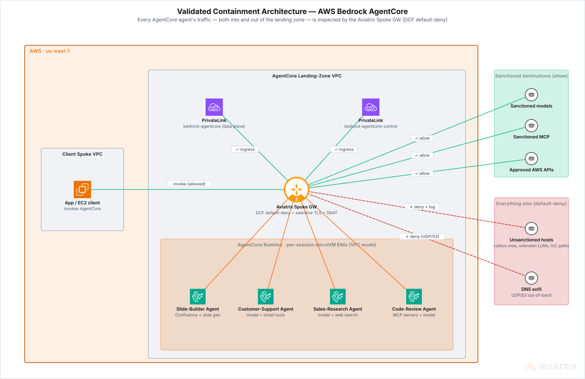

# agentcore-aws

Aviatrix Validated Containment Architecture blueprint for **AWS Bedrock AgentCore**. Deploys a transit + two spokes, places AgentCore Runtime ENIs in a customer VPC (VPC mode), fronts the AgentCore API with an in-path PrivateLink consumer endpoint, and enforces default-deny, domain-scoped egress via Aviatrix Distributed Cloud Firewall — with **selective TLS decryption + URL-path filtering** on the hosts where path-level granularity matters (Controller 9.0+).

See the sibling VCA spec at `Validated Containment Architectures/AWS Bedrock AgentCore/01-PRD.md` for the full design rationale and threat model. This blueprint ships the full scenario set plus an ALB-fronted demo UI; Browser / Code Interpreter / Gateway are deferred to v2.

## Architecture



- **Egress from Runtime ENIs** (10.50.10.0/24) routes through the AgentCore spoke gateway. DCF evaluates each flow against rules keyed on a subnet SmartGroup (source) and per-category WebGroups (destination) — allowed models, sanctioned tools, AWS control-plane, MCP servers. Default deny on anything else.
- **URL-path enforcement** via rule `-29-` on the `github_hosts` FQDN SmartGroup — selective TLS decryption (the spoke GW trusts the Aviatrix MITM CA) blocks supply-chain IoC paths like Shai-Hulud while letting legitimate GitHub paths through.
- **Ingress from client** (10.60.10.0/24) routes transit → AgentCore spoke GW → interface VPC endpoint. DCF evaluates with `src = client spoke` and `dst = PrivateLink endpoint FQDN SmartGroup` resolved via a shared Route 53 Private Hosted Zone.
- **IAM guardrail** (`vpc_mode_guardrail_policy_arn` output) denies `CreateAgentRuntime` / `CreateAgentRuntimeEndpoint` with `Null`-and-`ForAnyValue` conditions so operators cannot silently create runtimes in PUBLIC mode or with foreign subnets.
- **ALB-fronted UI** (IP-allowlisted) for browser access to the scenario cards. Ingress is controlled by the ALB security group, allowlisted to `var.ui_ingress_cidrs`.

No HA on transit or spokes in v1. Both spokes run with `single_ip_snat = true` so internet egress works directly from the spoke gateway. Selective TLS decryption is configured per-policy (rule `-29-`) and coexists with SNAT in Controller 9.0.10+; there is no fabric-wide SNAT-off requirement.

## Prerequisites

| Tool | Version | Purpose |
|---|---|---|
| Terraform | >= 1.5 | Deploy the blueprint |
| AWS CLI | configured | ECR login, SSM, validation |
| Podman | machine running | Build the ARM64 agent container image (the build path uses `podman` explicitly; Docker is not a drop-in) |
| `jq` | any | Reads controller responses during validation |
| Aviatrix Controller | 8.1+ (FQDN SmartGroups GA) | DCF + SmartGroup support |
| AWS permissions | ECR, VPC, IAM, Route 53, EC2, SSM, `secretsmanager:*`, `cloudformation:*`, `bedrock-agentcore-control:Create*`, `bedrock-agentcore:*` (data plane Create/Invoke) | Create all resources |

**Region:** `us-east-2` is recommended and is the only region this blueprint has been deployed end-to-end. The variable accepts the broader AgentCore-supported set, but individual AZs within those regions can be excluded for AgentCore data-plane PrivateLink — `us-east-1` in particular has hit AZ-level "not supported" failures mid-apply.

## Deploy

```bash
cd blueprints/agentcore-aws

# 1. Fetch the Aviatrix DCF MITM CA from your controller.
#    The repo ignores *.pem on purpose — regenerate locally from the
#    controller you'll deploy against. The runtime image's src-hash
#    references the PEM, so terraform init fails without it.
export AVIATRIX_CONTROLLER_IP=<your controller>
export AVIATRIX_USERNAME=admin
export AVIATRIX_PASSWORD='<aviatrix-admin-pw>'
./scripts/fetch-avx-ca.sh
# writes avx-root-ca.pem at the blueprint root + in agent/

# 2. Credentials for Terraform — TF_VAR_* env vars (keeps secrets out of tfvars).
export TF_VAR_controller_ip="${AVIATRIX_CONTROLLER_IP}"
export TF_VAR_controller_username="${AVIATRIX_USERNAME}"
export TF_VAR_controller_password="${AVIATRIX_PASSWORD}"
export TF_VAR_aviatrix_aws_account_name=AWS      # Aviatrix-onboarded account name

cp terraform.tfvars.example terraform.tfvars
# REQUIRED: set ui_ingress_cidrs to your public IP, e.g.
#   echo "ui_ingress_cidrs = [\"$(curl -s https://checkip.amazonaws.com)/32\"]" >> terraform.tfvars
# Other variables have sensible defaults; edit non-secret values as needed.

terraform init
terraform plan        # ~75 resources
terraform apply
```

Expected deploy time: ~25-30 minutes (transit + 2 spokes attach each take ~3-4 min; AgentCore Runtime create + container build+push ~4-5 min).

> **Known transient — provider "inconsistent final plan" on `aviatrix_web_group.allowed_mcp_servers`.** The first apply occasionally fails with `was cty.StringVal("mcp.deepwiki.com"), but now cty.StringVal("<lambda-url>.on.aws")` because the controller resolves the SNI through CNAMEs at apply time. Re-run `terraform apply` — the next plan sees the resolved value and the resource creates cleanly. Reported upstream as a provider bug.

## Test

```bash
# Open the ALB-fronted UI in your browser (allowlisted to ui_ingress_cidrs)
terraform output -raw ui_alb_url
```

Walk the scenario chips in the UI. The UI ships six cards; each maps to one DCF outcome with the containment toggle ON:

| Scenario chip (UI route) | Expected verdict | DCF / IAM rule matched |
|---|---|---|
| `llm01_prompt_inject_exfil` | `CONTAINED` | `-100-runtime-default-deny` |
| `llm02_dns_exfil` | `CONTAINED` | `-50-runtime-dns-exfil-deny` |
| `llm05_compromised_mcp` | `CONTAINED` | `-33-runtime-to-allowed-mcp-servers` (allow-list, untrusted MCP host hits default-deny) |
| `llm05b_supply_chain_url_path` | `CONTAINED` | `-29-runtime-deny-supply-chain-ioc-github` |
| `llm08_shadow_model` | `CONTAINED` | `-100-runtime-default-deny` |
| `drift_public_mode` | `CONTAINED` | `vpc-mode-guardrail` (IAM, not DCF) |

The Bedrock InvokeModel happy-path call (`-30-runtime-to-allowed-models` PERMIT) fires inside every card; flip the containment toggle OFF on any card to compare PERMIT vs DENY side-by-side. See [`tests/smoke-ui.md`](tests/smoke-ui.md) for the full UI walkthrough.

Verify in CoPilot:

1. **Topology** — transit + 2 spokes + DCF badge
2. **Security → DCF → SmartGroups** — `runtime-subnet`, `agentcore-data-host`, `agentcore-control-host`, `client-spoke`, `any`
3. **Security → DCF → Web Groups** — `allowed-models`, `allowed-tools`, `aws-control-domains`, `allowed-mcp-servers`, `supply-chain-ioc-github` populated with their SNI / URL filters
4. **Security → DCF → Monitor → filter `src_smart_group = agentcore-vca-runtime-subnet`** — allowed Bedrock flows and denied internet flows both visible with human-readable rule names
5. **Security → DCF → Monitor → filter `action = DENY`** — entries for the three denied probes

> **Note:** Filtering by SmartGroup is supported by DCF Monitor, not FlowIQ. FlowIQ is the flow-visualization view and filters on source/destination IPs and gateways. If you see Monitor entries with rule `UNKNOWN`, those are usually flows that hit the default action (no rule ID attached) — visible by the IPs involved.

### Next: tests/

- [`tests/smoke-ui.md`](tests/smoke-ui.md) — ~10-minute UI smoke checklist for the ALB-fronted scenario UI; run after every fresh deploy.

## Resources created

| Resource | Count | Approx hourly cost | Notes |
|---|---|---|---|
| Aviatrix Transit Gateway | 1 (no HA) | $0.50 | `t3.medium` by default |
| Aviatrix Spoke Gateway (AgentCore) | 1 (no HA) | $0.25 | single_ip_snat true |
| Aviatrix Spoke Gateway (Client) | 1 (no HA) | $0.25 | single_ip_snat true |
| VPC + subnets (x2) | 2 | — | 10.50.0.0/16 + 10.60.0.0/16 |
| Interface VPC endpoint (bedrock-agentcore) | 1 | $0.01 × AZs | data plane |
| Interface VPC endpoint (bedrock-agentcore-control) | 1 | $0.01 × AZs | control plane |
| Route 53 Private Hosted Zones | 2 | $0.50/mo each | data + control hostnames |
| ECR repo | 1 | minimal | force_delete = true |
| AgentCore Runtime (idle) | 1 | $0 when no sessions | pay-per-CPU-second during sessions |
| Client invoker EC2 | 1 | ~$0.02 | `t4g.small` ARM64 |
| IAM policy (VPC-mode guardrail) | 1 | — | Attach to admin roles out-of-band |
| DCF SmartGroups | 5 | — | 1 subnet, 2 fqdn, 1 vpc, 1 cidr |
| DCF WebGroups | 3 | — | models, tools, aws-control |
| DCF policies | 9 | — | 2 ingress permit + 4 runtime-egress permit + 3 deny |

**Idle cost estimate: ~$1.10/hr ≈ $27/day**. AgentCore session invocations add per-CPU-second billing.

## Destroy

```bash
terraform destroy
```

The AgentCore Runtime terminates any active sessions; ECR force-delete handles the image; Aviatrix spoke/transit detach cleanly.

> **Known transient — runtime-subnet stuck on `Still destroying...` then DependencyViolation.** The AgentCore Runtime ENIs (`InterfaceType=agentic_ai`, `Attachment.InstanceOwnerId=amazon-aws`, an `ela-attach-*` attachment) are AWS-managed and clean up asynchronously after the Runtime resource is destroyed. The cleanup is **slow** (observed: 20+ minutes from runtime destroy to ENI release, sometimes more). Terraform polls AWS on `DependencyViolation` and eventually errors out on `aws_subnet.agentcore_runtime` and `aws_security_group.runtime`. The `ela-attach-*` attachment cannot be detached manually (AWS returns `OperationNotPermitted: You are not allowed to manage 'ela-attach' attachments`); only AWS' async cleanup can release it.
>
> Wait for the ENI to disappear, then re-run `terraform destroy`. Check progress with:
> ```bash
> aws ec2 describe-network-interfaces --region <region> \
>   --filters Name=subnet-id,Values=<runtime-subnet-id> \
>   --query "NetworkInterfaces[].{Id:NetworkInterfaceId,Type:InterfaceType,Status:Status}"
> ```
> Empty result = ENI gone = next `terraform destroy` will succeed.

## Troubleshooting

**Provider produced inconsistent final plan on `aviatrix_web_group.allowed_mcp_servers` during the first `terraform apply`.** The controller resolves the MCP host SNI through CNAMEs at apply time, so the planned value (`mcp.deepwiki.com`) and the realized value (a `*.lambda-url.<region>.on.aws` host) diverge. Re-run `terraform apply` — the next plan picks up the resolved value and the resource creates cleanly. Reported upstream as a provider bug.

**`terraform apply` fails with AZ-level "not supported for AgentCore" partway through, in regions other than `us-east-2`.** AgentCore data-plane PrivateLink is not yet available in every AZ of every supported region. Destroy and redeploy in `us-east-2` (the variable's default and the only end-to-end-tested region for this blueprint).

**UI scenarios report the agent failing on AWS API calls (Bedrock, STS) or the AgentCore Runtime image pull is blocked.** Check that `terraform.tfvars` includes the full `aws_control_domains` list from `terraform.tfvars.example`. The ECR auth API (`api.ecr.<region>.amazonaws.com`), the S3 ECR layer bucket (`prod-<region>-starport-layer-bucket.s3.<region>.amazonaws.com`), and Secrets Manager are required for AgentCore VPC-mode image pull and agent runtime; missing any of them causes DCF to deny the flow. The per-account ECR registry hostname is appended automatically from the current AWS caller identity.

**`terraform destroy` hangs on `aws_subnet.agentcore_runtime: Still destroying...`, then errors with `DependencyViolation`.** The AgentCore Runtime keeps an `agentic_ai`-type ENI (`ela-attach-*` attachment) in the runtime subnet for many minutes after the Runtime resource itself is destroyed (observed: 20+ minutes). The attachment is AWS-managed and cannot be detached manually (`OperationNotPermitted: You are not allowed to manage 'ela-attach' attachments`); only AWS' async cleanup can release it. The same applies to `aws_security_group.runtime` because the ENI references it. Wait for the ENI to disappear (`aws ec2 describe-network-interfaces --filters Name=subnet-id,Values=<runtime-subnet-id>` returns empty), then re-run `terraform destroy` to clean up the remaining VPC/subnet/SG.

**DCF Monitor entries show rule `UNKNOWN` for some flows.** These are flows that matched the default action rather than a specific rule (no rule ID is attached to default-action hits). The IPs involved tell you which traffic it is — usually background management chatter or flows that the blueprint deliberately doesn't enumerate.

**First `terraform apply` fails with IAM `AccessDenied` errors mentioning `secretsmanager`, `cloudformation`, or `bedrock-agentcore`.** The deploying principal needs those services in addition to the canonical ECR / VPC / IAM / Route 53 / EC2 / SSM set. See the AWS permissions row of the Prerequisites table for the full list.

## Known limitations (v1)

- **No TLS decryption.** WebGroups match on SNI only. URL paths, methods, and bodies are invisible. This is a deliberate v1 choice (see PRD § TLS decryption feasibility).
- **No Browser / Code Interpreter / Gateway.** Toggles reserved for v2.
- **AgentCore → AgentCore data plane calls from the runtime are intra-VPC** and bypass DCF. Our threat model is egress to unapproved external destinations; internal PrivateLink hits from the agent are authorized by design.
- **Subnet-type SmartGroup requires Controller 8.1+.** FQDN SmartGroups require the same.
- **`hashicorp/aws` has no AgentCore resource** as of this blueprint; we use `awscc` (CloudFormation-registry-backed) for the Runtime. If AWS publishes a first-class provider resource later, migrate.

## Tested with

| Component | Version |
|---|---|
| Terraform | 1.14.x |
| aviatrix provider | 3.2.x |
| aws provider | 6.x |
| awscc provider | 1.80+ |
| Aviatrix Controller | 8.1+ |
