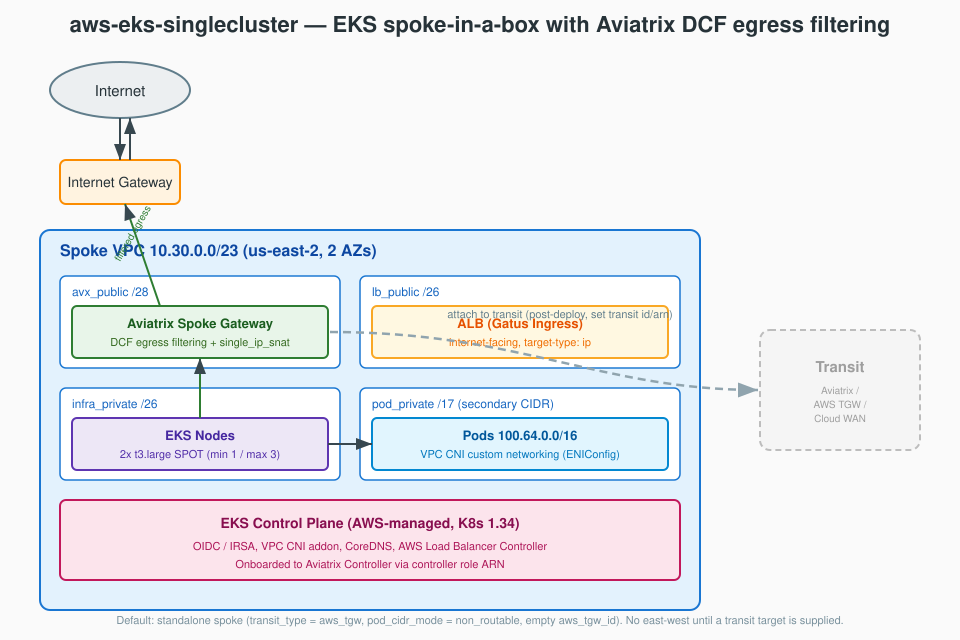

# Single-Cluster EKS Spoke-in-a-Box Secured by the Aviatrix Cloud Native Security Fabric

This blueprint deploys a **single EKS cluster** inside a self-contained "spoke-in-a-box" AWS VPC, fronted by an Aviatrix spoke gateway that performs **Distributed Cloud Firewall (DCF) egress filtering**. It demonstrates the Aviatrix Cloud Native Security Fabric (CNSF) for Kubernetes — threat prevention (GeoBlock + ThreatIntel), egress allow-listing with WebGroups (SNI/URL filtering), and Zero Trust enforcement — on a deliberately minimal footprint.

The blueprint deploys **standalone by default** (no transit attachment). It is built on the reusable [`modules/aws-eks-spoke-vpc`](../../modules/aws-eks-spoke-vpc/README.md) module, so an operator can attach the spoke to any transit (Aviatrix, AWS Transit Gateway, or AWS Cloud WAN) post-deploy by setting one variable and re-applying. It is a single-cluster derivative of [`aws-eks-multicluster`](../aws-eks-multicluster/README.md).

> [!TIP]
> **🤖 Optimized for Claude Code** — Run `/deploy-blueprint aws-eks-singlecluster` for AI-guided deployment with prerequisite checks and automated orchestration, or `/analyze-blueprint aws-eks-singlecluster` for resource and cost details. [Get Claude Code](https://claude.ai/code)

---

## Architecture



A single spoke VPC (`10.30.0.0/23`) contains four subnet tiers across two AZs:

- **`avx_public` (/28)** — Aviatrix spoke gateway. All cluster egress is SNAT'd here (`single_ip_snat`) and filtered by DCF.
- **`lb_public` (/26)** — internet-facing ALB created by the AWS Load Balancer Controller for the Gatus Ingress.
- **`infra_private` (/26)** — EKS managed node group (2× t3.large SPOT).
- **`pod_private` (/17)** — pod ENIs from the secondary CIDR (`100.64.0.0/16`) via VPC CNI custom networking.

Egress data flow: **Pod / Node → Aviatrix Spoke Gateway (DCF + SNAT) → IGW → Internet**. The DCF ruleset blocks GeoBlocked countries and threat-intel IPs first, then permits only EKS-required AWS services and an allow-list of domains (kubernetes.io, GitHub Aviatrix repos, npm).

The spoke is **standalone by default** — there is no east-west connectivity until a transit target is supplied (see below). A dashed line in the diagram shows the optional post-deploy transit attachment.

### Transit type × pod-CIDR mode matrix

The underlying module is driven by `transit_type` and `pod_cidr_mode`. Their interaction determines SNAT shape and route-table behavior (full detail in the [module README](../../modules/aws-eks-spoke-vpc/README.md#transit-type-and-pod-cidr-mode-matrix)):

| transit_type | pod_cidr_mode | SNAT | Route programming | Use-case |
|---|---|---|---|---|
| `aws_tgw` (default) | `non_routable` (default) | `single_ip_snat` | None (standalone); native routes when `aws_tgw_id` set | **Default standalone**; TGW attachment wired out-of-band |
| `aws_tgw` | `routable` | `single_ip_snat` | Pod east-west via TGW when `aws_tgw_id` set | Unique pod CIDRs advertised into TGW |
| `aws_cloudwan` | `non_routable` | `single_ip_snat` | None (standalone); native routes when ARN set | Cloud WAN attachment wired out-of-band |
| `aws_cloudwan` | `routable` | `single_ip_snat` | Pod east-west via Cloud WAN when ARN set | Unique pod CIDRs advertised into Cloud WAN |
| `aviatrix` | `non_routable` | Custom `aviatrix_gateway_snat` (3 policies) | Programmed by Aviatrix controller post-attach | Full Aviatrix fabric, overlapping pod CIDRs |
| `aviatrix` | `routable` | Custom `aviatrix_gateway_snat` (2 policies) | Programmed by Aviatrix controller post-attach | Full Aviatrix fabric, unique pod CIDRs |

**Standalone default explained:** with `transit_type = "aws_tgw"`, `pod_cidr_mode = "non_routable"`, and an **empty** `aws_tgw_id`, the spoke gateway is deployed with `single_ip_snat = true` and **no** route-table entries are programmed. The cluster has full filtered internet egress but no east-west reachability. To attach to a transit, set the relevant id/name for your `transit_type` and re-apply the `network` layer — the module then takes over route management.

---

## Prerequisites

Before deploying, ensure the following are in place. See [docs/prerequisites/](../../docs/prerequisites/README.md) for detailed install guides.

### Aviatrix Infrastructure

| Component | Requirement | Notes |
|-----------|-------------|-------|
| **[Aviatrix Control Plane](../../docs/prerequisites/aviatrix-controller.md)** | Compatible with provider ~> 8.2 | Controller + CoPilot, or an Aviatrix Cloud Fabric subscription |
| **AWS Account Onboarded** | Account registered in the Controller | Use the exact account name for `aviatrix_aws_account_name` |
| **Controller IAM role for EKS** | `aviatrix-role-app` ARN | Passed as `aviatrix_controller_role_arn` to the cluster layer |

### Local Tools

| Tool | Version | Installation | Purpose |
|------|---------|--------------|---------|
| **Terraform** | >= 1.9 | [Guide](../../docs/prerequisites/terraform.md) | Infrastructure provisioning |
| **AWS CLI** | v2 | [Guide](../../docs/prerequisites/aws-cli.md) | AWS auth + EKS `get-token` |
| **kubectl** | Latest | [Guide](../../docs/prerequisites/kubectl.md) | Cluster interaction, applying k8s-apps |
| **helm** | v3 | [Helm install](https://helm.sh/docs/intro/install/) | ALB Controller / k8s-firewall charts (installed via Terraform) |

### Required Access

- AWS credentials with permission to create VPC, EKS, EC2, IAM, ELB, and EKS add-on resources (`AdministratorAccess` is sufficient for demo).
- Aviatrix Controller credentials exported as environment variables (see below).

### Environment Variables

The Aviatrix provider authenticates via environment variables — required for `plan` and `apply` on the `network` and `cluster` layers:

```bash
export AVIATRIX_CONTROLLER_IP="<controller-ip-or-hostname>"
export AVIATRIX_USERNAME="<username>"
export AVIATRIX_PASSWORD="<password>"
export AWS_REGION="us-east-2"   # or use an AWS_PROFILE
```

---

## Resources Created

| Component | Resource | Qty | Size / Detail | Hourly | Monthly (~730h) |
|-----------|----------|-----|---------------|--------|-----------------|
| Aviatrix Spoke Gateway | EC2 | 1 | t3.medium, single_ip_snat, no HA | ~$0.04 | ~$30 |
| EKS Control Plane | EKS | 1 | Kubernetes 1.34 (AWS-managed) | $0.10 | $73 |
| EKS Node Group | EC2 | 2 (desired) | t3.large SPOT, min 1 / max 3 | ~$0.05 | ~$36 |
| ALB (Gatus Ingress) | ELBv2 | 1 | internet-facing, IP target type | ~$0.025 + LCU | ~$20 |
| VPC + subnets + IGW | Networking | 1 VPC | 4 subnet tiers × 2 AZs, no NAT GW | Free | $0 |
| DCF SmartGroups / WebGroups / Ruleset | Aviatrix | — | Threat prevention + egress allow-list | — | — |
| Pod / node EBS | gp3 | ~2 | ~20 GB each | — | ~$3 |

**Estimated cost:** **~$0.22/hour (~$160/month)** in us-east-2 when running.

> Excludes Aviatrix licensing (PAYG or BYOL), ALB LCU / data-processing charges, and internet egress data transfer. NAT Gateways are intentionally **not** deployed — Aviatrix SNAT replaces them.

---

## Deployment

The blueprint is a **4-layer** deployment. Deploy in order: **network → cluster → nodes → k8s-apps**.

```
network/    Layer 1  Spoke VPC (module), Aviatrix spoke gateway, DCF SmartGroups/WebGroups/Ruleset
cluster/    Layer 2  EKS control plane, OIDC/IRSA, VPC CNI addon, Controller onboarding
nodes/      Layer 3  k8s-firewall Helm chart, ENIConfig, node group, CoreDNS, ALB Controller
k8s-apps/   Layer 4  Gatus (kubectl apply); optional DCF CRD examples
```

Each layer reads the previous layer's outputs via `data "terraform_remote_state"` (local state only).

> **Automated:** `/deploy-blueprint aws-eks-singlecluster` orchestrates all layers with prerequisite checks.

### Step 0: Set environment variables

```bash
export AVIATRIX_CONTROLLER_IP="<controller-ip>"
export AVIATRIX_USERNAME="<username>"
export AVIATRIX_PASSWORD="<password>"
aws sts get-caller-identity   # verify AWS access
```

### Step 1: Network layer (~5-8 min)

```bash
cd network/
terraform init -upgrade
cp ../terraform.tfvars.example terraform.tfvars
# Edit terraform.tfvars: aviatrix_aws_account_name (required), aws_region, name_prefix.
# Leave transit_type/aws_tgw_id at defaults for a standalone spoke.
terraform apply
```

Creates: spoke VPC (`10.30.0.0/23`) with the four subnet tiers, the Aviatrix spoke gateway, and the DCF ruleset (SmartGroups, WebGroups, threat-prevention + egress allow rules).

### Step 2: Cluster layer (~10-15 min)

```bash
cd ../cluster/
terraform init
cp terraform.tfvars.example terraform.tfvars
# Edit terraform.tfvars: set aviatrix_controller_role_arn to your Controller's IAM role ARN
#   (e.g., arn:aws:iam::123456789012:role/aviatrix-role-app)
terraform apply
```

Creates: EKS control plane (K8s 1.34), OIDC provider, IRSA roles (ALB Controller, ExternalDNS), pod security group, and VPC CNI addon with custom networking. Onboards the cluster to the Aviatrix Controller.

### Step 3: Nodes layer (~5-7 min)

```bash
cd ../nodes/
terraform init
terraform apply
```

Creates (in order): k8s-firewall Helm chart (FirewallPolicy + WebGroupPolicy CRDs) → ENIConfig (one per AZ) → managed node group (2× t3.large SPOT) → CoreDNS addon → AWS Load Balancer Controller (Helm).

### Step 4: Configure kubectl + deploy k8s-apps (~1-2 min)

```bash
cd ../cluster/
$(terraform output -raw configure_kubectl)
kubectl get nodes   # should show 2 Ready nodes

# Deploy Gatus (ClusterIP Service + ALB Ingress)
kubectl create namespace gatus
kubectl apply -f ../k8s-apps/gatus.yaml

# Get the ALB hostname (provisioning takes 2-3 min)
kubectl get ingress -n gatus
```

Open the ALB hostname in a browser to view the Gatus dashboard.

**Total deployment time:** ~25-35 minutes.

---

## Variables

### Network layer (`network/`) — also the top-level `terraform.tfvars.example`

| Variable | Description | Type | Default | Required |
|----------|-------------|------|---------|----------|
| `name_prefix` | Prefix for all resource names | string | `"eks-singlecluster"` | no |
| `aviatrix_aws_account_name` | AWS account name registered in the Controller | string | — | **yes** |
| `aws_region` | AWS region | string | `"us-east-2"` | no |
| `vpc_cidr` | Primary VPC CIDR (/23) | string | `"10.30.0.0/23"` | no |
| `pod_cidr` | Secondary CIDR for pods | string | `"100.64.0.0/16"` | no |
| `transit_type` | `aviatrix` \| `aws_tgw` \| `aws_cloudwan` | string | `"aws_tgw"` | no |
| `pod_cidr_mode` | `routable` \| `non_routable` | string | `"non_routable"` | no |
| `transit_gw_name` | Aviatrix transit gateway name (only when `transit_type = aviatrix`) | string | `""` | no |
| `aws_tgw_id` | AWS TGW ID (only when `transit_type = aws_tgw`); empty = standalone | string | `""` | no |
| `aws_cloudwan_core_network_arn` | Cloud WAN Core Network ARN (only when `transit_type = aws_cloudwan`); empty = standalone | string | `""` | no |

### Cluster layer (`cluster/`)

| Variable | Description | Type | Default | Required |
|----------|-------------|------|---------|----------|
| `aws_region` | AWS region | string | `"us-east-2"` | no |
| `kubernetes_version` | EKS Kubernetes version | string | `"1.34"` | no |
| `aviatrix_controller_role_arn` | IAM role ARN used by the Controller to access the cluster | string | — | **yes** |

### Nodes layer (`nodes/`)

| Variable | Description | Type | Default | Required |
|----------|-------------|------|---------|----------|
| `aws_region` | AWS region | string | `"us-east-2"` | no |
| `alb_controller_chart_version` | AWS Load Balancer Controller Helm chart version | string | `"1.10.1"` | no |
| `node_group_config` | Node group sizing/instance object (`min_size`, `max_size`, `desired_size`, `instance_types`, `capacity_type`) | object | `{1, 3, 2, ["t3.large"], "SPOT"}` | no |

---

## Outputs

### Network layer

| Output | Description |
|--------|-------------|
| `vpc_id` | Spoke VPC ID |
| `vpc_cidr` / `secondary_cidr` | Primary VPC CIDR / pod CIDR |
| `availability_zones` | AZs used by the spoke |
| `cluster_name` | Derived EKS cluster name (`<name_prefix>-cluster`) |
| `lb_public_subnet_ids` / `infra_private_subnet_ids` / `pod_private_subnet_ids` | Subnet IDs per tier |
| `spoke_gateway_name` / `spoke_gateway_private_ip` | Aviatrix spoke gateway name and SNAT target IP |
| `dcf_ruleset_uuid` | UUID of the DCF egress ruleset |
| `smartgroup_cluster_vpc_uuid` | UUID of the cluster VPC SmartGroup |
| `webgroup_github_aviatrix_uuid` | UUID of the GitHub Aviatrix WebGroup (for CRD reference) |

### Cluster layer

| Output | Description |
|--------|-------------|
| `cluster_name` / `cluster_version` / `cluster_endpoint` | EKS cluster identity |
| `cluster_certificate_authority_data` | Base64 CA data (sensitive) |
| `cluster_primary_security_group_id` / `node_security_group_id` / `pod_security_group_id` | Security group IDs |
| `oidc_provider_arn` / `cluster_oidc_issuer_url` | OIDC / IRSA |
| `alb_controller_role_arn` / `external_dns_role_arn` | IRSA role ARNs |
| `configure_kubectl` | `aws eks update-kubeconfig` command |

### Nodes layer

| Output | Description |
|--------|-------------|
| `node_group_id` / `node_group_arn` / `node_group_status` | Node group identity and status |
| `node_group_autoscaling_group_names` | ASG names backing the node group |
| `iam_role_arn` | Node group IAM role ARN |

---

## Test Scenarios

### Scenario 1: Egress allow-list (DCF permits)

The Gatus dashboard's **Egress** group probes `kubernetes.io`, the Aviatrix GitHub repos, and `registry.npmjs.org` — all explicitly allow-listed via WebGroups in `network/dcf.tf`.

```bash
kubectl get ingress -n gatus   # open the ALB hostname in a browser
```

**Expected:** all Egress endpoints are **green** (HTTP 200).

### Scenario 2: Threat prevention (DCF blocks)

The **Threats** group probes a GeoBlocked destination (Iran) and a threat-intel IP, matched by the GeoBlock (IR/KP/RU) and ThreatIntel (major/critical) SmartGroups.

**Expected:** Threat endpoints are **red / blocked**. (The threat-feed IP must be present in your current ThreatGuard feed — update it in `gatus.yaml` if your feed differs.)

### Scenario 3: Verify in CoPilot

1. **Security > Distributed Cloud Firewall** — confirm the `<name_prefix>-egress` ruleset and its rules.
2. **FlowIQ** — generate traffic from Gatus and confirm permitted flows for allow-listed domains and dropped flows for the threat destinations.
3. **Topology** — confirm the spoke gateway and VPC appear.

### Scenario 4: East-west after attaching to a transit

The spoke is standalone by default (no east-west). To validate east-west:

```bash
cd network/
# In terraform.tfvars set aws_tgw_id (or transit_gw_name / aws_cloudwan_core_network_arn
# to match transit_type), then:
terraform apply
```

The module then programs east-west routes. Verify reachability to another spoke/VPC behind the same transit.

---

## CoPilot Verification

| View | What to confirm |
|------|-----------------|
| **Topology** | Spoke gateway + VPC visible; transit edge appears once attached |
| **FlowIQ** | Permitted egress to allow-listed domains; dropped flows to threat destinations |
| **Security > DCF** | `<name_prefix>-egress` ruleset, SmartGroups (cluster VPC, GeoBlock, ThreatIntel), WebGroups |
| **Security > Threat Prevention** | GeoBlock / ThreatIQ hits on the blocked probes |

---

## Troubleshooting

### No east-west connectivity

**Symptom:** pods/nodes can reach the internet but not other VPCs.

**Cause:** this is expected — the spoke is **standalone** by default. Set `aws_tgw_id` (or `transit_gw_name` / `aws_cloudwan_core_network_arn` matching your `transit_type`) in `network/terraform.tfvars` and re-apply. The module then programs east-west routes.

### Aviatrix-programmed routes disappear after apply

**Cause:** route tables with inline routes drop controller-programmed entries on re-apply. The module already applies `lifecycle { ignore_changes = [route] }` to all route tables — do not remove it.

### Aviatrix provider auth errors during plan/apply

**Symptom:** the `network` or `cluster` layer fails authenticating to the Controller.

**Solution:** export `AVIATRIX_CONTROLLER_IP`, `AVIATRIX_USERNAME`, and `AVIATRIX_PASSWORD` before running Terraform. The provider has no other auth source.

### Pods can't reach EC2 metadata / ALB stuck pending

**Cause:** pods use the non-routable secondary CIDR (`100.64.0.0/16`); pod traffic is SNAT'd to the spoke gateway via `single_ip_snat`. The ALB Controller Helm release sets `vpcId` and `region` explicitly to work around the metadata restriction. Verify the ALB Controller deployment is running:

```bash
kubectl get deployment -n kube-system aws-load-balancer-controller
```

### Threat probe shows green (not blocked)

**Cause:** the threat-feed IP in `gatus.yaml` is not in your current ThreatGuard feed. Replace it with an IP present in your feed, or rely on the GeoBlock probe.

### Terraform "chicken-and-egg" / count errors

**Cause:** layers deployed out of order. Always deploy **network → cluster → nodes**, and confirm the prior layer's `terraform.tfstate` exists before the next.

---

## Cleanup

Destroy in **reverse order**. Remove Kubernetes LoadBalancer/Ingress resources first so the ALB is deleted before its VPC/subnets.

```bash
# Step 1: remove k8s-apps (deletes the ALB)
kubectl delete -f k8s-apps/gatus.yaml
kubectl delete namespace gatus
sleep 60   # wait for the ALB to be torn down

# Step 2: nodes layer
cd nodes/ && terraform destroy

# Step 3: cluster layer
cd ../cluster/ && terraform destroy

# Step 4: network layer (spoke GW, VPC, DCF policies)
cd ../network/ && terraform destroy
```

### Verify cleanup

```bash
aws ec2 describe-vpcs --filters "Name=tag:Blueprint,Values=aws-eks-singlecluster"
# Expect: no VPCs returned
```

> If a destroy leaves stale DCF SmartGroups/WebGroups on the Controller, remove them from CoPilot **Security > DCF**.

---

## Tested With

| Component | Version |
|-----------|---------|
| Terraform | 1.14 |
| AWS Provider | ~> 6.0 |
| Aviatrix Provider | 8.2.x |
| `terraform-aws-modules/eks/aws` | ~> 21.x |
| Kubernetes (EKS) | 1.34 |
| Helm provider | ~> 2.x |

> The blueprint may work with other versions; these are the versions used for validation.

---

## Related

- [`modules/aws-eks-spoke-vpc`](../../modules/aws-eks-spoke-vpc/README.md) — the spoke-in-a-box VPC module (transit/pod-CIDR matrix, SNAT, route programming).
- [`aws-eks-multicluster`](../aws-eks-multicluster/README.md) — the multi-cluster blueprint this is derived from.
- `k8s-apps/dcf-crd/` — standalone FirewallPolicy / WebGroupPolicy CRD examples for in-cluster, namespace-level controls.
