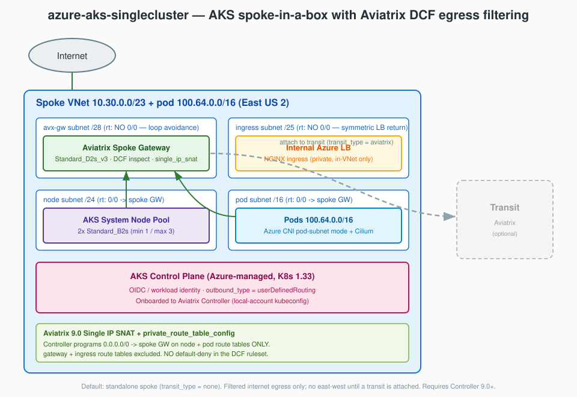

# Single-Cluster AKS Spoke-in-a-Box Secured by the Aviatrix Cloud Native Security Fabric

This blueprint deploys a **single AKS cluster** inside a self-contained "spoke-in-a-box" Azure VNet, fronted by an Aviatrix spoke gateway that performs **Distributed Cloud Firewall (DCF) egress filtering**. It demonstrates the Aviatrix Cloud Native Security Fabric (CNSF) for Kubernetes — threat prevention (GeoBlock + ThreatIQ), egress allow-listing with WebGroups (SNI / URL filtering), and Zero Trust enforcement — on a deliberately minimal Azure footprint.

The blueprint deploys **standalone by default** (no transit attachment). Egress is delivered entirely through the Aviatrix **9.0 Single IP SNAT explicit-route-table-selection** feature: the Controller programs `0.0.0.0/0 → spoke gateway` on the node and pod route tables only, leaving the gateway and ingress route tables untouched. It is built on two reusable modules — [`modules/azure-aks-spoke-vnet`](../../modules/azure-aks-spoke-vnet/README.md) and [`modules/azure-aks-cluster`](../../modules/azure-aks-cluster/README.md) — so an operator can attach the spoke to an Aviatrix transit post-deploy by setting one variable and re-applying. It is the Azure analogue of [`aws-eks-singlecluster`](../aws-eks-singlecluster/README.md) and a slimmed single-cluster derivative of [`azure-aks-multicluster`](../azure-aks-multicluster/README.md).

> [!NOTE]
> **Live deploy-verified** (2026-06-05, Controller 9.0.10, provider 9.0.0, AKS 1.33). Full deploy → enforce → destroy cycle validated: the 9.0 Single-IP-SNAT route-table selection, AKS `userDefinedRouting` bring-up, Aviatrix onboarding, internal-LB ingress, and **DCF egress enforcement** (allow-list permits + datapath-confirmed deny) all work. Geo/ThreatIQ blocking additionally requires the Controller's GeoIP/ThreatGuard intelligence feed to be populated — a Controller-side prerequisite independent of this blueprint's (correct) DCF config.

> [!IMPORTANT]
> **Defaults to Controller/provider 9.0; an 8.2 path is supported.** As shipped, this blueprint targets **Controller 9.0+** using Single-IP-SNAT `private_route_table_config` explicit-route-table selection. For an **Aviatrix Controller 8.2** — which does *not* honor that 9.0 selection — deploy the 8.2 variant with three edits (live-verified 2026-06-08 on Controller 8.2.10):
> 1. `network/versions.tf` **and** `cluster/versions.tf`: set the aviatrix provider to `version = "~> 8.2.0"`.
> 2. `network/main.tf`: point the spoke module at the 8.2 variant — `source = "../../../modules/azure-aks-spoke-vnet-82"`. It does Single IP SNAT via a blackhole `0.0.0.0/0 → None` placeholder that the 8.2 controller auto-selects (no `private_route_table_config`).
> 3. `nodes`: set `k8s_firewall_chart_version = "8.2.0"` to match the controller major.
>
> These can't be a single runtime toggle: mc-spoke 9.0.0 (which provides `private_route_table_config`) requires provider `>= 9.0.0`, and the provider major must match the controller — so the version pins are a static, deploy-time choice. Details: [`modules/azure-aks-spoke-vnet-82`](../../modules/azure-aks-spoke-vnet-82/README.md).

> [!TIP]
> **🤖 Optimized for Claude Code** — Run `/deploy-blueprint azure-aks-singlecluster` for AI-guided deployment with prerequisite checks and automated orchestration, or `/analyze-blueprint azure-aks-singlecluster` for resource and cost details. [Get Claude Code](https://claude.ai/code)

---

## Architecture



A single spoke VNet carries two address spaces — a routable `/23` (`10.30.0.0/23`) and a dedicated pod CIDR (`100.64.0.0/16`) — carved into four subnets, each with its own route table:

- **`<name>-avx-gw` (/28)** — Aviatrix spoke gateway. In the default standalone posture, all internet-bound egress is Single-IP-SNAT'd here (`single_ip_snat`) and filtered by DCF; when attached to an Aviatrix transit (`transit_type = "aviatrix"`), east-west traffic is routed over the transit tunnel and only internet-bound egress is SNAT'd. Route table is **excluded** from `private_route_table_config` (loop avoidance).
- **`<name>-ingress` (/25)** — internal Azure load balancer created by the in-cluster NGINX ingress controller. Route table is **excluded** so the LB replies directly to in-VNet clients (symmetric return path).
- **`<name>-node` (/24)** — AKS system node pool VMs. Route table gets `0/0 → spoke GW`.
- **`<name>-pod` (/16)** — pod IPs via Azure CNI pod-subnet mode + Cilium. Route table gets `0/0 → spoke GW`.

### Egress data flow

```
   Pod / Node (VNet IP)
        │  UDR 0.0.0.0/0  (programmed by the Controller on node + pod route tables)
        ▼
   Aviatrix Spoke Gateway
        │  DCF inspection (GeoBlock / ThreatIQ deny → egress allow-list)
        │  Single IP SNAT (every workload egresses as the GW public IP)
        ▼
   Internet
```

The DCF ruleset blocks GeoBlocked countries (IR / KP / RU) and ThreatIQ (major/critical) destinations first, then permits only the Azure / AKS-required SNIs and a small allow-list of domains (kubernetes.io, npm, GitHub Aviatrix repos). There is **no default-deny rule** — a `0.0.0.0/0` deny would also match RFC1918 inter-VNet traffic, which would break east-west once a transit is attached.

The spoke is **standalone by default** (`transit_type = "none"`) — there is no east-west connectivity until a transit target is supplied. The dashed line in the diagram shows the optional post-deploy Aviatrix transit attachment (`transit_type = "aviatrix"` + `transit_gw_name`).

---

## Prerequisites

See [docs/prerequisites/](../../docs/prerequisites/README.md) for detailed install guides.

### Aviatrix Infrastructure

| Component | Requirement | Notes |
|-----------|-------------|-------|
| **[Aviatrix Control Plane](../../docs/prerequisites/aviatrix-controller.md)** | **9.0+ REQUIRED** | `private_route_table_config` + Single IP SNAT route-table selection on Azure are 9.0-only. On 8.2 the plan/apply will drift. Controller + CoPilot, or an Aviatrix Cloud Fabric subscription. |
| **Azure account onboarded** | Azure access account registered in the Controller | Use the exact account name for `aviatrix_azure_account_name`. The account's service principal needs Contributor (or `listClusterUserCredential` at subscription scope) so the Controller can onboard the AKS cluster. |
| **Aviatrix Terraform provider** | `~> 9.0` | Matches the Controller. |

### Local Tools

| Tool | Version | Installation | Purpose |
|------|---------|--------------|---------|
| **Terraform** | >= 1.7 | [Guide](../../docs/prerequisites/terraform.md) | Infrastructure provisioning |
| **Azure CLI** | Latest | [Guide](../../docs/prerequisites/azure-cli.md) | `az login` auth + `az aks get-credentials` |
| **kubectl** | Latest | [Guide](../../docs/prerequisites/kubectl.md) | Cluster interaction, applying k8s-apps |
| **helm** | v3 | [Helm install](https://helm.sh/docs/intro/install/) | ingress-nginx / k8s-firewall charts (installed via Terraform) |

### Required Access

- An Azure subscription with quota for AKS, 2× `Standard_B2s` nodes, 1× `Standard_D2s_v3` gateway VM, a public IP, and a Standard internal load balancer.
- `az login` completed (the `azurerm` provider uses the Azure CLI credential chain by default).
- Aviatrix Controller credentials (IP / username / password) supplied via the `network/` and `cluster/` tfvars.

---

## Resources Created

| Component | Resource | Qty | Size / Detail | Hourly | Monthly (~730h) |
|-----------|----------|-----|---------------|--------|-----------------|
| Aviatrix Spoke Gateway | VM | 1 | Standard_D2s_v3 (2 vCPU / 8 GB), single_ip_snat, no HA | ~$0.10 | ~$70 |
| Spoke GW public IP | Public IP | 1 | Standard, static | ~$0.005 | ~$4 |
| AKS Control Plane | AKS | 1 | Kubernetes 1.33 (free tier, Azure-managed) | $0 | $0 |
| AKS Node Pool | VM | 2 (desired) | Standard_B2s, min 1 / max 3 | ~$0.10 | ~$70 |
| Internal LB (NGINX ingress) | Load Balancer | 1 | Standard, internal | ~$0.025 | ~$18 |
| VNet + subnets + route tables | Networking | 1 VNet | 4 subnet tiers, 4 route tables, no NAT Gateway | Free | $0 |
| DCF SmartGroups / WebGroups / Ruleset | Aviatrix | — | Threat prevention + egress allow-list | — | — |
| Node / pod managed disks | OS disk | ~2 | ~30 GB each | — | ~$5 |

**Estimated cost:** **~$0.23/hour (~$170/month)** in East US 2 when running.

> Figures are **approximate and vary by region** — verify in the [Azure Pricing Calculator](https://azure.microsoft.com/pricing/calculator/). Excludes Aviatrix licensing (PAYG or BYOL), load-balancer data-processing charges, and internet egress data transfer. No NAT Gateway is deployed — Aviatrix Single IP SNAT replaces it.

---

## Deployment

The blueprint is a **4-layer** deployment. Deploy in order: **network → cluster → nodes → k8s-apps**.

```
network/    Layer 1  Spoke VNet (module), Aviatrix spoke GW (Single IP SNAT), DCF SmartGroups/WebGroups/Ruleset
cluster/    Layer 2  AKS control plane, workload identity, role assignments, Controller onboarding
nodes/      Layer 3  ingress-nginx (internal Azure LB) + Aviatrix k8s-firewall CRD controller (Helm)
k8s-apps/   Layer 4  Gatus (kubectl apply); optional DCF CRD examples
```

Each layer reads the previous layer's outputs via `data "terraform_remote_state"` (local state only — no remote backend).

> **Automated:** `/deploy-blueprint azure-aks-singlecluster` orchestrates all layers with prerequisite checks.

### Step 0: Authenticate

```bash
az login
az account set --subscription "<your-subscription>"
```

The Aviatrix Controller IP / username / password are supplied via tfvars (see below), not environment variables.

### Step 1: Network layer (~5-8 min)

```bash
cd network/
terraform init -upgrade
cp terraform.tfvars.example terraform.tfvars
# Edit terraform.tfvars: aviatrix_azure_account_name, azure_region + aviatrix_azure_region
# (BOTH region forms), name_prefix, and the aviatrix_controller_ip/username/password.
# Leave transit_type = "none" for a standalone spoke.
terraform apply
```

Creates: the spoke VNet (`10.30.0.0/23` + pod `100.64.0.0/16`), four subnets and route tables, the Aviatrix spoke gateway with Single IP SNAT, and the DCF ruleset (SmartGroups, WebGroups, threat-prevention + egress allow rules).

### Step 2: Cluster layer (~10-15 min)

```bash
cd ../cluster/
terraform init
cp terraform.tfvars.example terraform.tfvars
# Edit terraform.tfvars: aviatrix_controller_ip/username/password,
# aviatrix_controller_public_ip (for the AKS API allow-list), and
# authorized_ip_ranges (lock down for non-lab use).
terraform apply
```

Creates: the AKS control plane (K8s 1.33, Azure CNI pod-subnet mode + Cilium, `outbound_type = userDefinedRouting`), a user-assigned identity with Network Contributor over the VNet and node/pod route tables, the inline system node pool, and Aviatrix Controller onboarding.

### Step 3: Nodes layer (~3-5 min)

```bash
cd ../nodes/
terraform init
cp terraform.tfvars.example terraform.tfvars
terraform apply
```

Creates: the ingress-nginx Helm release (an **internal** Azure LB in the ingress subnet) and the Aviatrix k8s-firewall CRD controller Helm release.

### Step 4: Configure kubectl + deploy k8s-apps (~1-2 min)

```bash
cd ../cluster/
$(terraform output -raw configure_kubectl)   # az aks get-credentials ...
kubectl get nodes   # should show 2 Ready nodes

# Deploy Gatus (ClusterIP Service + NGINX Ingress)
kubectl apply -f ../k8s-apps/gatus.yaml

# Optional: apply the namespace-level DCF CRD examples
kubectl apply -f ../k8s-apps/dcf-crd/

# Reach the Gatus dashboard via the internal LB IP (from inside the VNet,
# or port-forward):
kubectl -n gatus port-forward svc/gatus 8080:8080
```

**Total deployment time:** ~20-30 minutes.

---

## Variables

### Network layer (`network/`)

| Variable | Description | Type | Default | Required |
|----------|-------------|------|---------|----------|
| `name_prefix` | Prefix for all resources; also the AKS cluster name (1-20 chars) | string | `"aks-single"` | no |
| `azure_region` | Azure region (azurerm form, e.g. `eastus2`) | string | `"eastus2"` | no |
| `aviatrix_azure_region` | Azure region (Aviatrix form, e.g. `East US 2`) | string | `"East US 2"` | no |
| `aviatrix_azure_account_name` | Azure access account name as onboarded in the Controller | string | — | **yes** |
| `vnet_cidr` | Routable /23 CIDR for the spoke VNet | string | `"10.30.0.0/23"` | no |
| `pod_cidr` | Dedicated pod subnet CIDR | string | `"100.64.0.0/16"` | no |
| `transit_type` | `none` (standalone) \| `aviatrix` (attach to transit) | string | `"none"` | no |
| `transit_gw_name` | Aviatrix transit gateway name (required when `transit_type = aviatrix`) | string | `""` | no |
| `aviatrix_controller_ip` | Aviatrix Controller IP / hostname | string | — | **yes** |
| `aviatrix_username` | Controller username | string | — | **yes** |
| `aviatrix_password` | Controller password (sensitive) | string | — | **yes** |

### Cluster layer (`cluster/`)

| Variable | Description | Type | Default | Required |
|----------|-------------|------|---------|----------|
| `kubernetes_version` | AKS Kubernetes version | string | `"1.33"` | no |
| `node_pool_config` | System node pool sizing (`node_count`, `min_count`, `max_count`, `vm_size`) | object | `{2, 1, 3, "Standard_B2s"}` | no |
| `authorized_ip_ranges` | Extra CIDRs allowed to reach the AKS API server (spoke GW IP appended automatically) | list(string) | `["0.0.0.0/0"]` | no |
| `enable_aviatrix_onboarding` | Register the cluster with the Controller for K8s SmartGroups | bool | `true` | no |
| `aviatrix_controller_public_ip` | Controller public egress IP for the AKS API allow-list when onboarding | string | `null` | no |
| `aviatrix_controller_ip` / `aviatrix_username` / `aviatrix_password` | Controller credentials | string | — | **yes** |

### Nodes layer (`nodes/`)

| Variable | Description | Type | Default | Required |
|----------|-------------|------|---------|----------|
| `nginx_ingress_chart_version` | ingress-nginx Helm chart version | string | `"4.11.3"` | no |
| `k8s_firewall_chart_version` | Aviatrix k8s-firewall Helm chart version (8.2.0 or 9.0.0) | string | `"9.0.0"` | no |
| `nginx_lb_ip` | Static internal LB IP (inside the ingress subnet, above the Azure-reserved first 4 hosts) | string | `"10.30.0.200"` | no |

---

## Outputs

### Network layer

| Output | Description |
|--------|-------------|
| `name_prefix` / `azure_region` | Naming + region passthrough |
| `resource_group_name` | Spoke resource group |
| `vnet_id` | Spoke VNet resource ID |
| `cluster_name` | Derived AKS cluster name |
| `node_subnet_id` / `pod_subnet_id` / `ingress_subnet_id` / `ingress_subnet_name` | Subnet IDs / ingress subnet name |
| `node_route_table_id` / `pod_route_table_id` | Route table IDs (for AKS identity role assignments) |
| `spoke_gateway_name` / `spoke_gateway_public_ip` | Aviatrix spoke gateway name + SNAT public IP |
| `service_cidr` / `dns_service_ip` | Kubernetes service CIDR + DNS IP |
| `dcf_ruleset_uuid` | UUID of the DCF egress ruleset |
| `smartgroup_cluster_vpc_uuid` | UUID of the cluster VNet SmartGroup |

### Cluster layer

| Output | Description |
|--------|-------------|
| `cluster_id` / `cluster_name` | AKS cluster identity |
| `oidc_issuer_url` | OIDC issuer (workload identity) |
| `host` / `client_certificate` / `client_key` / `cluster_ca_certificate` | Kubeconfig material (sensitive) |
| `configure_kubectl` | `az aks get-credentials` command |

### Nodes layer

| Output | Description |
|--------|-------------|
| `nginx_ingress_namespace` | ingress-nginx namespace |
| `nginx_lb_ip` | Internal LB IP |
| `k8s_firewall_namespace` | k8s-firewall namespace |

---

## Test Scenarios

### Scenario 1: Egress allow-list (DCF permits)

The Gatus dashboard's **Egress** group probes `kubernetes.io`, `registry.npmjs.org`, and the Aviatrix GitHub repo — all explicitly allow-listed via WebGroups in `network/dcf.tf`.

```bash
kubectl -n gatus port-forward svc/gatus 8080:8080   # open http://localhost:8080
```

**Expected:** all Egress endpoints are **green** (reachable).

### Scenario 2: Threat prevention (DCF blocks)

The **Threats** group probes a GeoBlocked destination (Iran) and a threat-intel sample IP, matched by the GeoBlock (IR / KP / RU) and ThreatIQ (major/critical) SmartGroups.

**Expected:** Threat endpoints are **red / blocked**. The threat-feed IP must be present in your current ThreatIQ feed — update it in `k8s-apps/gatus.yaml` if your feed differs, or rely on the GeoBlock probe.

### Scenario 3: Verify in CoPilot

1. **Security > Distributed Cloud Firewall** — confirm the `<name_prefix>-egress` ruleset and its rules (GeoBlock deny, ThreatIQ deny, then the egress permits).
2. **FlowIQ** — generate traffic from Gatus and confirm permitted flows for allow-listed domains and dropped flows for the threat / geo destinations.
3. **Topology** — confirm the spoke gateway and VNet appear (and the transit edge once attached).

### Scenario 4: East-west after attaching to a transit

The spoke is standalone by default (no east-west). To validate east-west:

```bash
cd network/
# In terraform.tfvars set transit_type = "aviatrix" and transit_gw_name = "<your-transit>", then:
terraform apply
```

The Controller then programs east-west routes. Verify reachability to another spoke / VNet behind the same transit.

---

## CoPilot Verification

| View | What to confirm |
|------|-----------------|
| **Topology** | Spoke gateway + VNet visible; transit edge appears once attached |
| **FlowIQ** | Permitted egress to allow-listed domains; dropped flows to threat / geo destinations |
| **Security > DCF** | `<name_prefix>-egress` ruleset, SmartGroups (cluster VNet, GeoBlock, ThreatIQ), WebGroups |
| **Security > Threat Prevention** | GeoBlock / ThreatIQ hits on the blocked probes |

---

## Troubleshooting

### Aviatrix-programmed 0/0 route drifts or is missing (Controller < 9.0)

**Symptom:** `terraform plan` keeps proposing to remove the `0.0.0.0/0 → spoke GW` route, or it never appears.

**Cause:** `private_route_table_config` and Single IP SNAT route-table selection on Azure are **9.0-only**. On Controller 8.2 the feature is not honored. **This blueprint requires Controller / CoPilot 9.0+.** Upgrade the Controller; do not remove the `lifecycle { ignore_changes = [route] }` blocks on the route tables.

### Region name duality

**Symptom:** the spoke gateway lands in a different region than the VNet, or the Controller rejects the region.

**Cause:** Azure needs two region forms. `azure_region` is the azurerm form (`eastus2`); `aviatrix_azure_region` is the Aviatrix form (`East US 2`). **Both are required** and must refer to the same region.

### `vpc_id` format for the spoke

The mc-spoke module addresses the Azure VNet as `vnet_name:resource_group:vnet_guid` (not an Azure resource ID). The module builds this automatically; if you reference the spoke from other Aviatrix resources, use the `aviatrix_vpc_id` output, not `vnet_id`.

### AKS nodes never become Ready / CSE bootstrap fails

**Symptom:** node provisioning stalls; the kubelet custom-script-extension (CSE) bootstrap times out.

**Cause / fix:**
- The AKS API server `authorized_ip_ranges` **must include the spoke GW public IP** — nodes egress through it. The cluster module appends it automatically, so do not strip it. The cluster layer defaults `authorized_ip_ranges` to `0.0.0.0/0` for lab convenience; **this exposes the API server publicly — lock it down to your admin IP for non-lab use** (the spoke GW IP is still appended).
- If provisioning stalls reaching package mirrors, the DCF egress allow-list may be missing an SNI. `acs-mirror.azureedge.net` / `packages.aks.azure.com` and the other Azure / AKS-required SNIs are included in `network/dcf.tf`; add any others your image needs.

### AKS create fails with `ErrCode_InsufficientVCPUQuota`

**Symptom:** the cluster layer apply fails creating the AKS cluster: `Insufficient vcpu quota requested 4, remaining 0 for family standardBSFamily`.

**Cause / fix:** the subscription/region has no remaining vCPU quota for the node VM family (the default `Standard_B2s` is `standardBSFamily`). Either request a quota increase, or override the node size via `node_pool_config.vm_size` to a family with quota (e.g., `Standard_D2s_v3`). Check with `az vm list-usage --location <region> -o table`.

### GitHub Aviatrix WebGroup matches nothing

**Symptom:** repo fetches to `github.com/AviatrixSystems/...` fail closed even though the WebGroup exists.

**Cause:** that WebGroup uses **URL-path filtering** (`urlfilter`), and path-level matching requires L7 / DPI. Verify on the live Controller that the path match is actually evaluated for your traffic; if not, fall back to an SNI (`snifilter = "github.com"`) match or widen the rule.

### Aviatrix onboarding fails (Entra-only auth)

**Symptom:** `aviatrix_kubernetes_cluster` errors fetching kubeconfig.

**Cause:** the Controller fetches a **local-account kubeconfig** via ARM `listClusterUserCredential`. Entra-ID-only AKS auth is **not supported** — the cluster must use Kubernetes RBAC with local accounts, and the Controller's public egress IP must be in `authorized_ip_ranges` (set `aviatrix_controller_public_ip`).

### Layer ordering / count errors

**Cause:** layers deployed out of order. Always deploy **network → cluster → nodes**, and confirm the prior layer's `terraform.tfstate` exists before the next.

---

## Cleanup

Destroy in **reverse order**. Remove Kubernetes LoadBalancer / Ingress resources and the k8s-firewall CRDs first so the internal Azure LB is torn down before its subnet, and so the CRD finalizers don't block deletion.

```bash
# Step 1: remove k8s-apps and the internal LB
kubectl delete -f k8s-apps/dcf-crd/   # remove CRD policies first (finalizers)
kubectl delete -f k8s-apps/gatus.yaml
kubectl delete svc --all -n ingress-nginx   # delete the internal LB service
sleep 60                                     # wait for the Azure LB to detach

# Step 2: nodes layer (ingress-nginx + k8s-firewall Helm releases)
cd nodes/ && terraform destroy

# Step 3: cluster layer (AKS, identity, onboarding)
cd ../cluster/ && terraform destroy

# Step 4: network layer (spoke GW, VNet, DCF policies)
cd ../network/ && terraform destroy
```

### Pod-subnet delegation caveat (`SubnetMissingRequiredDelegation`)

AKS attaches a `Microsoft.ContainerService/managedClusters` delegation to the pod subnet in pod-subnet mode. The module already sets `lifecycle { ignore_changes = [delegation] }` on the pod subnet, but the **network destroy can still fail** on the pod subnet / route-table association if the AKS service-association link lingers after the cluster layer is destroyed.

If `terraform destroy` on the `network/` layer fails with `SubnetMissingRequiredDelegation`:

```bash
# Destroy everything EXCEPT the pod subnet first, give Azure time to release the
# service-association link, then destroy the remainder.
cd network/
terraform destroy -target=module.spoke_vnet.module.spoke \
                  -target=module.spoke_vnet.azurerm_subnet_route_table_association.pod
# wait a few minutes for AKS to fully release the pod subnet, then:
terraform destroy
```

(See the `azure_aks_pod_subnet_delegation_drift` learning for background.)

### Verify cleanup

```bash
az group show --name "<name_prefix>-rg"   # expect: ResourceGroupNotFound
```

> If a destroy leaves stale DCF SmartGroups / WebGroups on the Controller, remove them from CoPilot **Security > DCF**.

---

## Tested With

| Component | Version |
|-----------|---------|
| Aviatrix Controller / CoPilot | 9.0.10 (**9.0+ required**) |
| Aviatrix Terraform Provider | 9.0.0 |
| Terraform | 1.14.0 (>= 1.7) |
| azurerm Provider | 4.76.0 (~> 4.0) |
| kubernetes Provider | ~> 2.30 |
| helm Provider | ~> 2.16 |
| `terraform-aviatrix-modules/mc-spoke/aviatrix` | 9.0.0 |
| `k8s-firewall` Helm chart | 9.0.0 |
| Kubernetes (AKS) | 1.33 |

> **Status: live deploy-verified (2026-06-05).** Full deploy → DCF enforcement → destroy cycle validated on the versions above. Geo/ThreatIQ blocking depends on the Controller's GeoIP/ThreatGuard feed being populated (see the note at the top). The blueprint may work with other versions.

---

## Related

- [`modules/azure-aks-spoke-vnet`](../../modules/azure-aks-spoke-vnet/README.md) — the spoke-in-a-box VNet module for **Controller 9.0+** (Single IP SNAT + `private_route_table_config` route-table selection). Default.
- [`modules/azure-aks-spoke-vnet-82`](../../modules/azure-aks-spoke-vnet-82/README.md) — the **Controller 8.2** variant of the spoke module (Single IP SNAT + blackhole `0/0 → None` route auto-selection; no `private_route_table_config`). Used by the 8.2 path above.
- [`modules/azure-aks-cluster`](../../modules/azure-aks-cluster/README.md) — the AKS cluster module (Azure CNI + Cilium, workload identity, Aviatrix onboarding).
- [`aws-eks-singlecluster`](../aws-eks-singlecluster/README.md) — the AWS analogue this blueprint mirrors.
- [`azure-aks-multicluster`](../azure-aks-multicluster/README.md) — the multi-cluster Azure blueprint this is derived from.
- `k8s-apps/dcf-crd/` — standalone FirewallPolicy / WebGroupPolicy CRD examples for in-cluster, namespace-level controls.
