# Github Actions - Secure AWS and Azure self-hosted runners

> **Claude-optimized deployment:** This blueprint is designed to be deployed end-to-end by Claude Code. Claude can run every Terraform step, monitor provisioning, manage the agent lifecycle, and execute the DCF data-exfiltration demo without any manual intervention. Optionally, add the Aviatrix MCP server to let Claude query live DCF logs, inspect firewall rules, and run network diagnostics directly from the conversation. See the [Deploying with Claude Code](#deploying-with-claude-code) section below.

Four blueprints across two runner types and two clouds. All route egress through an Aviatrix spoke gateway (SNAT) and enforce a DCF FQDN allow-list — blocking everything not explicitly permitted.

## Architecture

<p align="center">
  
</p>

**Traffic flow (all blueprints):** Runner VM or pod → Aviatrix spoke GW → SNAT to GW public IP → Internet.

**Controls:**
- Egress locked down by Aviatrix DCF: explicit PERMIT rules for GitHub Actions FQDNs, Ubuntu APT/registries, and optional tool-call FQDNs. Everything else hits `deny-*-unmatched-web` (DENY+watch by default — observe without enforce, flip to hard DENY via CoPilot UI).
- No Terraform redeploy needed to toggle enforcement — CoPilot UI only.

## Blueprints

---

### Self-hosted VM runners

A persistent VM registers as a GitHub Actions runner at boot. SmartGroup targets the VM by cloud tag.

| Blueprint | Cloud | Guide |
|---|---|---|
| [`azure-self-hosted-runner/`](azure-self-hosted-runner/) | Azure (VM) | [README](azure-self-hosted-runner/README.md) · [TESTING](azure-self-hosted-runner/TESTING.md) |
| [`aws-self-hosted-runner/`](aws-self-hosted-runner/) | AWS (EC2) | [README](aws-self-hosted-runner/README.md) · [TESTING](aws-self-hosted-runner/TESTING.md) |

**DCF SmartGroup:** VM-tag selector (`gh-action=runner`). No TLS decryption.

---

### ARC (Actions Runner Controller) — ephemeral pods

<p align="center">
  
</p>

ARC runs on Kubernetes (AKS / EKS). Runner pods are ephemeral — spin up on demand, scale to zero when idle. SmartGroups are k8s-type (per namespace). Adds TLS decryption for URL-path-based policy enforcement.

| Blueprint | Cloud | Guide |
|---|---|---|
| [`azure-action-runner-controller/`](azure-action-runner-controller/) | Azure (AKS) | [README](azure-action-runner-controller/README.md) · [TESTING](azure-action-runner-controller/TESTING.md) |
| [`aws-action-runner-controller/`](aws-action-runner-controller/) | AWS (EKS) | [README](aws-action-runner-controller/README.md) |

**DCF SmartGroup:** k8s-type per namespace (`arc-runners`, `arc-tls-probe`, `arc-systems`). Adds prio 25 `DECRYPT_ALLOWED` rule for URL-path matching.

> **ARC prerequisite:** enable on the Aviatrix controller before first apply — Settings → Feature Configuration:
> - Distributed Cloud Firewall → **Enabled**
> - Kubernetes → **Enabled**
> - K8s DCF Policies (auto-policy) → **Disabled** (blueprint manages policies via Terraform)

---

## Deploy

All blueprints require Aviatrix controller credentials as `TF_VAR_*` env vars (never in tfvars):

```bash
export TF_VAR_aviatrix_controller_ip=your-controller.example.com
export TF_VAR_aviatrix_username=admin
export TF_VAR_aviatrix_password=...
```

### Self-hosted VM runners

```bash
# Azure
cd azure-self-hosted-runner
cp terraform.tfvars.example terraform.tfvars
# edit: azure_subscription_id, aviatrix_account_name, location, github_pat, admin_password
terraform init && terraform apply

# AWS
cd aws-self-hosted-runner
cp terraform.tfvars.example terraform.tfvars
# edit: aws_region, aviatrix_account_name, github_repo_url, github_pat
terraform init && terraform apply
```

### ARC runners

```bash
# Azure ARC (AKS)
cd azure-action-runner-controller
cp terraform.tfvars.example terraform.tfvars
# edit: azure_subscription_id, aviatrix_account_name, aviatrix_sp_object_id,
#       location, github_pat, github_repo_url, aviatrix_mitm_ca_pem
terraform init && terraform apply

# AWS ARC (EKS)
cd aws-action-runner-controller
cp terraform.tfvars.example terraform.tfvars
# edit: aws_region, aviatrix_account_name, github_pat, github_repo_url, aviatrix_mitm_ca_pem
terraform init && terraform apply
```

## Security Policy Probes (ARC blueprints)

Both ARC blueprints (`azure-action-runner-controller/` and `aws-action-runner-controller/`) deploy two always-on probe pods alongside the ARC runner. They demonstrate two different DCF enforcement modes and serve as live policy validation — the same controls apply to any workflow job running on the ARC runner.

| Probe | Namespace | Target | DCF mechanism | What it shows |
|---|---|---|---|---|
| `ipify-probe` | `arc-runners` | `https://www.example.com` | Domain-name allow rule (SNI filter, prio 30) | Baseline FQDN-based egress control — traffic allowed by hostname match, no decryption needed |
| `tls-probe` | `arc-tls-probe` | `https://ipinfo.io/json` | URL-based allow rule (URL filter, prio 25) + `DECRYPT_ALLOWED` + `TLS_REQUIRED` | Deep inspection — GW decrypts the TLS session to match the full URL path, re-signs with Aviatrix CA, then re-encrypts toward the origin |

**Key point:** these are not test utilities — they mirror the policy controls that govern actual runner jobs. A workflow step that calls `curl https://www.example.com` hits the same FQDN rule as `ipify-probe`. A step that calls a URL-matched endpoint would require the same TLS decryption rule to be in place. Anything not explicitly permitted hits the catch-all `deny-*-unmatched-web` rule at prio 50.

**Expected vs blocked traffic:**
- `www.example.com` → **PERMITTED** — explicitly listed in `var.tool_call_fqdns`, matched by the FQDN allow rule at prio 30.
- `webhook.site` (or any destination not in the allow list) → **BLOCKED** — falls through to the catch-all DENY rule at prio 50. This is the supply-chain attack scenario: a compromised workflow step attempts to exfiltrate data to an attacker-controlled endpoint and is silently dropped.

Probe logs are visible in CoPilot → Security → Distributed Cloud Firewall → Logs, filtered by SmartGroup `*-runner-pods` or `*-tls-probe`.

## Test (PII exfiltration simulation)

Two workflows, one per runner type:

| Workflow | Runners | Trigger |
|---|---|---|
| **Test PII Exfiltration (self-hosted runners)** | `azure` / `aws` VM runners | Actions → select cloud |
| **Test PII Exfiltration (ARC / AKS runners)** | `azure-arc` / `aws-arc` ARC pods | Actions → select runner label |

**What both do:**
1. Fetch MOTD from `www.example.com` — permitted by DCF rule 30.
2. POST fake PII (SSN, CC, email) to your webhook — passes while rule 50 is DENY+watch, blocked after you switch to hard DENY via CoPilot.

**Result colors:** ✅ green = exfil BLOCKED (policy enforced). ❌ red = exfil SUCCEEDED (policy bypassed — security failure).

See per-blueprint `TESTING.md` for the full step-by-step guide.

## Cleanup

Self-hosted runners:
```bash
cd azure-self-hosted-runner && terraform destroy
cd aws-self-hosted-runner && terraform destroy
```

ARC blueprints — state rm required before destroy (k8s/helm providers can't connect to a deleted cluster):
```bash
# Azure ARC
cd azure-action-runner-controller
terraform state rm helm_release.arc_controller helm_release.arc_runner_scaleset \
  kubernetes_namespace.tls_probe[0] kubernetes_secret.aviatrix_ca[0] \
  kubernetes_deployment.tls_probe[0] kubernetes_deployment.ipify_probe[0] \
  kubernetes_config_map.disable_snat kubernetes_annotations.restart_masq_agent
terraform destroy

# AWS ARC
cd aws-action-runner-controller
terraform state rm helm_release.arc_controller helm_release.arc_runner_scaleset \
  kubernetes_namespace.tls_probe[0] kubernetes_secret.aviatrix_ca[0] \
  kubernetes_deployment.tls_probe[0] kubernetes_deployment.ipify_probe[0] \
  kubernetes_env.aws_node_externalsnat
terraform destroy
```


