# Github Actions - Secure Azure ARC Runners (AKS)

Deploys GitHub Actions [Actions Runner Controller (ARC)](https://github.com/actions/actions-runner-controller) on AKS in an Azure spoke VNet with all pod egress forced through an Aviatrix spoke gateway (SNAT). An Aviatrix Distributed Cloud Firewall (DCF) ruleset permits only a tightly scoped allow-list of FQDNs (GitHub Actions infrastructure, Ubuntu/container registries, plus any optional tool-call FQDNs you opt into) on TCP 80/443. All other egress is implicitly denied.

Unlike the self-hosted VM blueprint, ARC runner pods are ephemeral and scale to zero when idle — no cost for idle capacity.

## Architecture

<p align="center">
  
</p>

**Traffic flow:** ARC runner pod → Azure CNI VNet IP → Aviatrix spoke GW → SNAT to GW public IP → Internet.

**Controls:**
- **Pod IP preservation:** Azure CNI assigns each pod a real VNet IP. The `azure-ip-masq-agent` ConfigMap is patched (`nonMasqueradeCIDRs: 0.0.0.0/0`) so pod source IPs reach the spoke gateway unmasked — required for DCF k8s SmartGroup matching.
- **Egress:** AKS subnet route table has `0.0.0.0/0 → Aviatrix spoke ENI`. All outbound traffic from pods passes through the spoke GW and is subject to DCF policy.
- **DCF policy:** 7 rules (priorities 5–50). Separate k8s-type SmartGroups per namespace allow different rules for ARC system pods, runner pods, and the TLS-decrypt probe pod.
- **TLS decryption:** A dedicated `tls-probe` pod in `arc-tls-probe` namespace validates the `DECRYPT_ALLOWED` rule — the spoke GW decrypts TLS sessions, matches the URL path against the WebGroup, then re-encrypts toward the origin.

```
AKS pods (arc-runners / arc-tls-probe / arc-systems namespaces)
  │  Azure CNI — each pod gets a real VNet IP from aks_subnet_cidr
  │  ip-masq-agent patched: nonMasqueradeCIDRs 0.0.0.0/0 (pod IPs preserved)
  ▼
Aviatrix spoke GW (gw_subnet_cidr) — SNAT to public EIP
  ▼
DCF global policy list
  prio 5   PERMIT  arc-systems  → GitHub FQDNs        TCP 443
  prio 10  DENY    runner-pods  → ThreatIQ feed        ANY
  prio 20  PERMIT  runner-pods  → GitHub FQDNs        TCP 443
  prio 25  PERMIT  tls-probe    → ipinfo.io/json       TCP 443  DECRYPT_ALLOWED
  prio 30  PERMIT  runner-pods  → tool_call_fqdns      TCP 80/443
  prio 40  PERMIT  runner-pods  → APT / registries     TCP 80/443
  prio 50  DENY+watch runner-pods → All-Web            TCP 80/443  ← toggle watch off to enforce
```

Two always-on probe pods validate policy continuously after deployment:

| Probe | Namespace | Target | DCF rule |
|---|---|---|---|
| `ipify-probe` | `arc-runners` | `https://www.example.com` | Prio 30 — SNI FQDN allow |
| `tls-probe` | `arc-tls-probe` | `https://ipinfo.io/json` | Prio 25 — URL allow + `DECRYPT_ALLOWED` |

## Prerequisites

| Requirement | Detail | Verify |
|---|---|---|
| Terraform | >= 1.3 | `terraform version` |
| Azure CLI | Authenticated | `az account show` |
| Aviatrix Controller | Reachable; v8.2+ | `curl -sk https://$AVIATRIX_CONTROLLER_IP/v1/api` |
| Aviatrix account | Linked to the target Azure subscription | Aviatrix UI → Accounts |
| GitHub PAT | `repo` scope on the target repo | `curl -s -H "Authorization: Bearer $PAT" https://api.github.com/user` |

### Controller feature flags (one-time, manual)

Enable in the Aviatrix controller under **Settings → Feature Configuration**:

| Feature | Setting |
|---|---|
| Distributed Cloud Firewall | Enabled |
| Kubernetes | Enabled |
| K8s DCF Policies (auto-policy) | **Disabled** — blueprint manages policies via Terraform |

### Environment variables — never commit to tfvars

```bash
export TF_VAR_aviatrix_controller_ip=your-controller.example.com
export TF_VAR_aviatrix_username=admin
export TF_VAR_aviatrix_password=...
```

### Aviatrix service principal object ID

The blueprint assigns `Azure Kubernetes Service Cluster User Role` to the Aviatrix SP on the AKS cluster. Provide the SP object ID in `terraform.tfvars`:

```bash
az ad sp list --display-name "Aviatrix" --query "[].id" -o tsv
```

### Aviatrix MITM CA certificate

Required when `deploy_probes = true` (the default). The TLS-probe pod mounts this CA so curl trusts the spoke GW's re-signed certificate.

Fetch once from the controller:
```bash
TOKEN=$(curl -sk -X POST "https://<controller>/v1/api" \
  -d "action=login&username=admin&password=..." \
  | python3 -c "import sys,json; print(json.load(sys.stdin)['CID'])")
curl -sk "https://<controller>/v2.5/api/mitm/ca" -H "Authorization: cid $TOKEN"
```

Paste the PEM output into `terraform.tfvars` as `aviatrix_mitm_ca_pem`.

## Resources Created

| Resource | Count | Cost notes (USD, indicative, West Europe) |
|---|---|---|
| `azurerm_resource_group` | 1 | free |
| `azurerm_virtual_network` | 1 | free |
| `azurerm_subnet` (gw + aks) | 2 | free |
| `azurerm_route_table` | 2 | free |
| `azurerm_kubernetes_cluster` (AKS, `Standard_B2s_v2` × 1 node) | 1 | ~$30–35 / month |
| `azurerm_role_assignment` (subnet join × 2, AKS cluster user × 1) | 3 | free |
| `aviatrix_spoke_gateway` (`Standard_B2ms` underlying VM) | 1 | ~$60–70 / month VM + Aviatrix license |
| `aviatrix_smart_group` (runner-pods, tls-probe, arc-systems) | 3 | controller config — no infra cost |
| `aviatrix_web_group` | 3–4 | controller config — no infra cost |
| `aviatrix_dcf_tls_profile` | 1 | controller config — no infra cost |
| `aviatrix_distributed_firewalling_policy_list` | 1 | controller config — no infra cost |
| `helm_release` (arc-controller, arc-runner-scaleset) | 2 | no additional infra cost |
| `kubernetes_deployment` (ipify-probe, tls-probe) | 2 | pods run on the AKS node — no separate cost |

**Indicative total: ~$90–110 / month** for the Azure side, plus your Aviatrix license cost for one spoke gateway. ARC runner pods are ephemeral — no idle cost (scales to zero).

## Deploy

```bash
cd azure-action-runner-controller

# Aviatrix creds — env vars, never in tfvars
export TF_VAR_aviatrix_controller_ip=your-controller.example.com
export TF_VAR_aviatrix_username=admin
export TF_VAR_aviatrix_password=...

cp terraform.tfvars.example terraform.tfvars
# Required edits:
#   azure_subscription_id, aviatrix_account_name, aviatrix_sp_object_id
#   location, github_pat, github_repo_url, aviatrix_mitm_ca_pem

terraform init
terraform plan -out=tfplan   # review ~30 resources
terraform apply tfplan        # spoke GW + AKS take 10–15 min
```

After apply, ARC scales to 0 — no runner pod appears in GitHub until a workflow job is queued. First job takes ~30 s for pod spin-up.

Outputs after apply:

| Output | Description | Sensitive |
|---|---|---|
| `deployment_id` | 6-digit suffix appended to every named resource | no |
| `resource_group_name` | Resource group hosting the spoke VNet and AKS cluster | no |
| `vnet_id` | Spoke VNet ID | no |
| `aks_subnet_id` | AKS subnet ID | no |
| `spoke_gateway_name` | Aviatrix spoke gateway name | yes |
| `spoke_gateway_public_ip` | GW public IP — SNAT egress IP for AKS pods | yes |
| `aks_cluster_name` | AKS cluster name | no |
| `aks_kube_config` | Raw kubeconfig (admin) | yes |
| `aks_node_resource_group` | AKS-managed node RG | no |
| `arc_runner_label` | `runs-on:` label for workflows | no |
| `runner_smart_group_uuid` | UUID of the DCF SmartGroup matching runner pods | no |

### Verify probes

```bash
az aks get-credentials \
  --resource-group $(terraform output -raw resource_group_name) \
  --name $(terraform output -raw aks_cluster_name)

# ipify-probe — should print OK every 10s
kubectl logs -n arc-runners deployment/ipify-probe --tail=5

# tls-probe — should print JSON with an IP in the Azure/Microsoft range
kubectl logs -n arc-tls-probe deployment/tls-probe --tail=5
```

## Test Scenarios

See [TESTING.md](TESTING.md) for the full step-by-step security test guide (simulated PII exfiltration with DCF watch-mode observation, then enforcement).

### 1. PII exfiltration test (workflow)

The workflow [`.github/workflows/test-pii-exfil-arc.yml`](../.github/workflows/test-pii-exfil-arc.yml) runs on the ARC runner pod and:
1. Fetches a MOTD from `www.example.com` (should always succeed — rule 30).
2. POSTs fake PII to a user-supplied webhook URL (succeeds while rule 50 is DENY+watch; fails once switched to hard DENY via CoPilot).

**Trigger:** `workflow_dispatch` — select `azure-arc`, provide a [webhook.site](https://webhook.site) URL.

**Expected phase 1** (watch=true): both `www.example.com` and `webhook.site` POST succeed. PII appears on webhook.site.

**Expected phase 2** (watch=false): `www.example.com` succeeds; `webhook.site` POST times out (0/3 retries). Nothing on webhook.site.

Trigger via API:
```bash
PAT=$(grep github_pat terraform.tfvars | cut -d'"' -f2)
REPO=$(grep github_repo_url terraform.tfvars | cut -d'"' -f2 | sed 's|https://github.com/||')

curl -sS -X POST \
  -H "Authorization: Bearer $PAT" \
  -H "Accept: application/vnd.github+json" \
  "https://api.github.com/repos/${REPO}/actions/workflows/test-pii-exfil-arc.yml/dispatches" \
  -d '{"ref":"main","inputs":{"webhook_url":"https://webhook.site/<uuid>","runner_label":"azure-arc","retries":"3"}}'
```

### 2. TLS decryption validation (probe)

Check that `tls-probe` returns JSON from `ipinfo.io/json` — this confirms the spoke GW is decrypting TLS sessions and the URL-based WebGroup rule at prio 25 is matching:

```bash
kubectl logs -n arc-tls-probe deployment/tls-probe --tail=3
# Expected: {"ip": "x.x.x.x", "city": "...", "org": "AS8075 Microsoft Corporation", ...}
# The IP must be an Azure/Microsoft-owned address — confirms SNAT via GW.
```

### 3. Tool-call FQDN expansion

Add a domain to `var.tool_call_fqdns`, re-apply, then confirm access from a runner job. The DCF tool-call rule at prio 30 is created only when the list is non-empty.

## Switch watch to hard DENY (phase 2)

Rule 50 starts as `DENY + watch = true`. To enforce:

1. **CoPilot** → **Security** → **Distributed Cloud Firewall** → **Policy**.
2. Find rule priority **50** (`deny-*-unmatched-web`).
3. Click **Edit** → **Watch Mode** → **Off** → **Save**.

No Terraform redeploy needed. To revert, switch Watch Mode back to **On**.

## Cleanup

k8s/helm providers cannot connect to a deleted AKS cluster — remove those resources from state first:

```bash
cd azure-action-runner-controller

terraform state rm helm_release.arc_controller
terraform state rm helm_release.arc_runner_scaleset
terraform state rm kubernetes_namespace.tls_probe[0]
terraform state rm kubernetes_secret.aviatrix_ca[0]
terraform state rm kubernetes_deployment.tls_probe[0]
terraform state rm kubernetes_deployment.ipify_probe[0]
terraform state rm kubernetes_config_map.disable_snat
terraform state rm kubernetes_annotations.restart_masq_agent

terraform destroy
```

After destroy, the ARC runner scale set is de-registered from GitHub automatically. If the runner row persists as "offline", delete it manually under **Settings → Actions → Runners**.

## Troubleshooting

| Symptom | Likely cause | Fix |
|---|---|---|
| `Missing required argument "controller_ip"` | `TF_VAR_aviatrix_*` env vars not exported | `export TF_VAR_aviatrix_controller_ip=...` etc; re-run |
| Helm release timeout (`arc_controller`) | AKS not fully ready | Retry `terraform apply` without changes — idempotent |
| ARC runner pod never registers | PAT lacks `repo` scope, or DCF blocks GitHub FQDNs | Check PAT scope; verify `aviatrix_web_group.gh_runner_required` contains `github.com` + `api.github.com` |
| `tls-probe` prints `BLOCKED` | Prio 25 SmartGroup hasn't resolved pod IP yet | Wait 3–5 min for controller to inventory new pods; check CoPilot → Kubernetes |
| `ipify-probe` prints `BLOCKED` | DCF rule 50 is hard DENY and prio 30 tool-call rule missing `www.example.com` | Verify `var.tool_call_fqdns` includes `www.example.com`; re-apply |
| `terraform destroy` fails — k8s provider can't connect | AKS deleted before k8s resources were removed from state | Run `terraform state rm` for k8s/helm resources, then retry destroy (see Cleanup) |
| `aviatrix_distributed_firewalling_policy_list` fails — conflicting ruleset | Another policy list already at `TERRAFORM_BEFORE_UI_MANAGED` | Remove it from Aviatrix UI → DCF → Policy, then re-apply |
| SmartGroup delete fails — `present in one or more dfw policies` | Policy list not yet destroyed | `terraform destroy -target=aviatrix_distributed_firewalling_policy_list.runner` first |

## Variables

Aviatrix controller credentials are passed via env vars only — never in `terraform.tfvars`:

```bash
export TF_VAR_aviatrix_controller_ip=...
export TF_VAR_aviatrix_username=...
export TF_VAR_aviatrix_password=...
```

| Name | Description | Default |
|---|---|---|
| `aviatrix_controller_ip` | Controller hostname (no `https://`) — **env var only** | *(required)* |
| `aviatrix_username` | Controller username — **env var only** | *(required)* |
| `aviatrix_password` | Controller password — **env var only** | *(required)* |
| `aviatrix_sp_object_id` | Object ID of the Aviatrix Azure SP — assigned AKS Cluster User Role | *(required)* |
| `azure_subscription_id` | Azure subscription ID | *(required)* |
| `aviatrix_account_name` | Aviatrix account name mapped to the Azure subscription | *(required)* |
| `location` | Azure region — singleword form (e.g. `westeurope`, `centralindia`) | *(required)* |
| `github_pat` | PAT with `repo` scope — used by ARC to register runners | *(required)* |
| `github_repo_url` | GitHub repo URL for ARC runner scale set registration | *(required)* |
| `aviatrix_mitm_ca_pem` | PEM of Aviatrix MITM CA — mounted into TLS-probe pod | `""` (required when `deploy_probes=true`) |
| `name_prefix` | Prefix for all named resources. 6-digit deployment ID auto-appended | `gh-aks-runner` |
| `spoke_gateway_name` | Aviatrix spoke GW name. When `null`, auto-derived from `name_prefix` | `null` |
| `arc_runner_name` | ARC scale set name — the `runs-on:` label in workflows | `azure-arc` |
| `deploy_probes` | Deploy TLS-probe and ipify-probe pods | `true` |
| `vnet_cidr` | Spoke VNet address space | `10.10.30.0/24` |
| `gw_subnet_cidr` | Aviatrix spoke GW subnet | `10.10.30.0/26` |
| `aks_subnet_cidr` | AKS subnet (Azure CNI — each pod gets a VNet IP) | `10.10.30.128/25` |
| `spoke_gw_size` | Azure VM size for the spoke gateway | `Standard_B2ms` |
| `aks_node_count` | AKS default node pool size | `1` |
| `aks_node_vm_size` | AKS node VM size | `Standard_B2s_v2` |
| `aks_kubernetes_version` | Kubernetes version (`null` = AKS region default) | `null` |
| `aks_service_cidr` | ClusterIP service CIDR (must not overlap VNet) | `10.100.0.0/16` |
| `aks_dns_service_ip` | DNS service IP (within `aks_service_cidr`) | `10.100.0.10` |
| `gh_runner_required_fqdns` | FQDNs ARC + runner pods require (TCP 443) | *(GitHub Actions infra — see `variables.tf`)* |
| `tool_call_fqdns` | Extra FQDNs for agent/tool calls (TCP 80+443) | `[]` (rule omitted when empty) |

## Outputs

| Name | Description | Sensitive |
|---|---|---|
| `deployment_id` | 6-digit suffix identifying this deployment | no |
| `resource_group_name` | Resource group hosting VNet and AKS | no |
| `vnet_id` | Spoke VNet ID | no |
| `aks_subnet_id` | AKS subnet ID | no |
| `spoke_gateway_name` | Aviatrix spoke gateway name | yes |
| `spoke_gateway_public_ip` | GW public IP — SNAT egress address for pods | yes |
| `aks_cluster_name` | AKS cluster name | no |
| `aks_kube_config` | Raw kubeconfig (admin) for the AKS cluster | yes |
| `aks_node_resource_group` | AKS-managed node RG (VMs/NICs) | no |
| `arc_runner_label` | `runs-on:` label for workflows | no |
| `runner_smart_group_uuid` | UUID of the DCF SmartGroup matching runner pods | no |

## Tested With

| Component | Version |
|---|---|
| Terraform | 1.7.x |
| `hashicorp/azurerm` | 3.117.1 |
| `AviatrixSystems/aviatrix` | 8.2.10 |
| `hashicorp/helm` | 2.17.0 |
| `hashicorp/kubernetes` | 2.37.1 |
| `hashicorp/random` | 3.9.0 |
| Aviatrix Controller | 8.2.x |
| AKS Kubernetes version | 1.30.x |
| ARC chart (`gha-runner-scale-set-controller`) | 0.9.x |
| ARC chart (`gha-runner-scale-set`) | 0.9.x |
| Azure region (validated) | `westeurope` |

---
