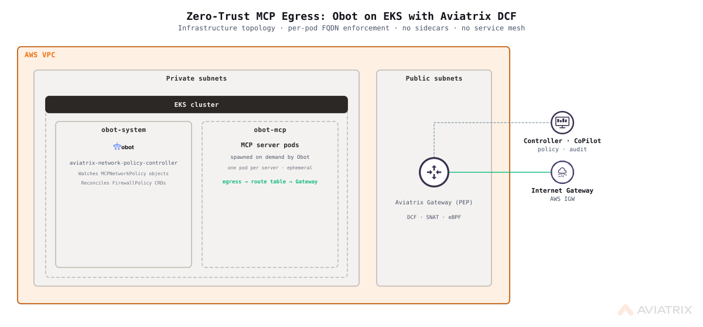

# Zero-Trust MCP Egress: Obot on EKS with Aviatrix DCF

Deploy [Obot](https://obot.ai) onto a new EKS cluster with network-layer zero-trust egress enforcement for all MCP server pods. An Aviatrix spoke gateway intercepts outbound traffic; MCPNetworkPolicy CRDs (reconciled by Obot's bundled aviatrix-network-policy-controller) translate per-server allowlists into live FirewallPolicy rules. No sidecars, no service mesh, no code changes required.

## Architecture



Architecture diagram coming soon.

Traffic flow:

1. Obot user creates an MCP server and configures its allowed egress domains via the Obot UI or API.
2. Obot's bundled `aviatrix-network-policy-controller` reconciles the server's `MCPNetworkPolicy` into an Aviatrix `FirewallPolicy` CRD.
3. The Aviatrix controller pushes the policy to the spoke gateway.
4. The spoke gateway enforces FQDN-based egress: permitted domains pass, everything else is dropped and logged.

The vpc-cni addon is configured with `EXTERNALSNAT=true`, which disables per-node SNAT and ensures the spoke gateway sees original pod IPs. SmartGroups resolve pod identities via Kubernetes label selectors; however, see the EKS Limitation section below.

## Scope and Limitations

- **Supported MCP runtimes:** `npx`, `uvx`, and containerized servers only. Stdio-mode servers are not covered.
- **Protocol and port:** Enforcement applies to HTTPS egress on TCP 443 only. MCP servers requiring non-443 outbound connections are not protected by this feature.
- **Remote MCP servers:** Out of scope. This feature applies only to Kubernetes-hosted MCP servers deployed by Obot. Remote (SSE/HTTP) MCP server connections are not subject to these policies.
- **Domain format:** `egressDomains` entries must be bare hostnames. No protocols (`https://`), paths, ports, or IP addresses. `localhost` and `*.svc` cluster-local names are rejected by Obot at admission. Wildcard prefix notation is supported (e.g., `*.anthropic.com`).
- **EKS K8s SmartGroup resolution requires correct RBAC setup.** CoPilot authenticates to EKS using `aviatrix-role-app` (not `aviatrix-role-ec2`). The blueprint creates an EKS access entry for `aviatrix-role-app` with `AmazonEKSClusterAdminPolicy` plus `view-nodes` and `aviatrix-crd-view` ClusterRoles. If the cluster shows "Partial" after deploy, verify `aviatrix_app_role_arn` points to the correct role ARN and re-toggle "Enforcement on Kubernetes" in CoPilot. Per-pod enforcement via `FirewallPolicy` CRDs and `K8S_POLICY_LIST` works correctly (confirmed: permitted domains pass, non-permitted domains blocked).
- **Obot-specific domains are scoped to the `obot-system` namespace.** The blueprint creates a V1 permit SmartGroup using a K8s namespace selector (`k8s_namespace = var.obot_namespace`). This restricts the permit covering `api.anthropic.com`, GitHub, and `charts.obot.ai` to orchestration pods only. MCP server pods in `obot-mcp` do not match this rule and cannot reach those domains unless declared in `egressDomains`.
- **`npx` runtime servers require `registry.npmjs.org` in `egressDomains`.** The npx shim downloads the package from npm at pod startup. A server deployed without `registry.npmjs.org` in its `egressDomains` will have its `mcp` container fail (package download blocked) while the `shim` container stays running. This is intentional: zero-trust requires explicit declaration of every outbound dependency, including package registries.
- **Node bootstrap race with spoke gateway.** `node_desired_size` defaults to `2`. EKS nodes that start before the Aviatrix spoke gateway programs the VPC route tables fail to bootstrap (CSE exit 50, unreachable API server). EKS managed node groups replace failed nodes automatically; re-bootstrap succeeds once routes are in place. Set `node_desired_size = 0` in `terraform.tfvars` if you need to avoid this race (then use Step 4 to scale up after the apply).

## Prerequisites

### Required Tools

- [Aviatrix Control Plane](../../docs/prerequisites/aviatrix-controller.md) (v8.2+) with CoPilot; Controller and CoPilot public IPs required
- [Terraform](../../docs/prerequisites/terraform.md) (v1.5+)
- [AWS CLI](../../docs/prerequisites/aws-cli.md), authenticated (`aws configure` or equivalent)
- [kubectl](../../docs/prerequisites/kubectl.md), configured for your cluster (EKS authentication uses the AWS CLI exec plugin)
- **Python 3** — required by `local-exec` provisioners for JSON parsing (`curl | python3 -c`)

### Required Access

- AWS account with permissions to create VPCs, subnets, IAM roles, EKS clusters, and managed node groups
- Aviatrix Controller with an AWS access account (`aws_access_account`) already onboarded
- IAM permissions: `eks:*`, `ec2:*`, `iam:CreateRole`, `iam:AttachRolePolicy`, `iam:PassRole`

### Blueprint-Specific Requirements

- Obot >= 0.21.0 (the MCPNetworkPolicy egress provider was introduced in this release)
- `vpc_cidr` must not overlap any existing VPCs in the same region if you plan to peer or connect them later
- AWS CLI must be installed and on `PATH`; kubectl uses it as the exec credential plugin for EKS

## Resources Created

| Resource | Description | Quantity |
|----------|-------------|----------|
| AWS VPC | VPC for EKS nodes and spoke gateway | 1 |
| AWS Subnet (private) | EKS node subnets, one per AZ (/24 each) | 3 |
| AWS Subnet (public) | Aviatrix spoke gateway subnet (/24) | 1 |
| AWS Internet Gateway | Provides outbound path for spoke gateway | 1 |
| AWS Route Table | Public RT for spoke gateway subnet | 1 |
| AWS Route Table | Private RT for EKS node subnets (routes pod egress via spoke) | 1 |
| EKS Cluster | EKS cluster with vpc-cni (EXTERNALSNAT=true) | 1 |
| EKS Managed Node Group | EC2 managed node group (default desired=2; set `node_desired_size=0` to delay startup) | 1 |
| IAM Role | vpc-cni IRSA role (EXTERNALSNAT=true requires IRSA) | 1 |
| aws_eks_addon (vpc-cni) | Manages pod networking with EXTERNALSNAT=true | 1 |
| Aviatrix Spoke Gateway | DCF-enforced egress gateway (no transit required) | 1 |
| Aviatrix SmartGroup | MCP server pods (K8s label selector; resolves pod IPs when RBAC is correctly configured) | 1 |
| Aviatrix SmartGroup | EKS VPC CIDR | 1 |
| Aviatrix SmartGroup | obot-system namespace (K8s selector, scopes orchestration-tier V1 permits) | 1 |
| Aviatrix SmartGroup | obot-mcp pod /32 CIDRs (conditional on var) | 1 |
| Aviatrix WebGroup | EKS infrastructure egress domains (ECR, S3, SSM, EC2, EKS endpoints, charts.obot.ai) | 1 |
| Aviatrix WebGroup | Obot application domains (Anthropic, GitHub) | 1 |
| Aviatrix DCF Policy List | V1 infrastructure permits (P1: infra, P2: obot-system, P3: obot-mcp deny conditional) | 1 |
| Aviatrix DCF Default Action | Deny-all at POST_RULES level | 1 |
| CoPilot Association | null_resource to associate spoke with CoPilot | 1 |
| Remote Syslog | Index 9, UDP 5000 to CoPilot private IP | 1 |
| Kubernetes Namespace | Obot system namespace | 1 |
| Kubernetes Namespace | Obot MCP server namespace | 1 |
| Helm Release | k8s-firewall (Aviatrix CRDs: FirewallPolicy + WebgroupPolicy; no pods) | 1 |
| Helm Release | Obot platform (embedded SQLite, NPC self-managed) | 1 |
| EKS Access Entry | `aviatrix-role-app` with `AmazonEKSClusterAdminPolicy` (CoPilot K8s API auth) | 1 |
| Kubernetes ClusterRole | `view-nodes` (node enumeration for CoPilot) | 1 |
| Kubernetes ClusterRole | `aviatrix-crd-view` (CRD list/watch for `networking.aviatrix.com`) | 1 |

**Estimated Cost**: ~$0.15-0.25/hour for the spoke gateway EC2 instance plus EKS node costs (~$0.10-0.20/hour for m5.large at 2 nodes). EKS control plane: $0.10/hour.

> **Storage note:** This blueprint uses Obot's embedded SQLite (`dev.useEmbeddedDb: true`), which stores data on an EBS-backed PVC (gp3, 8 GiB). This is appropriate for lab and demo use. For production, replace with an external Postgres database: set `OBOT_SERVER_DSN` to your RDS or Aurora endpoint in the Obot Helm values and remove `dev.useEmbeddedDb: true`. Doing so eliminates the EBS PVC and the aws-ebs-csi-driver dependency, at the cost of an additional RDS instance (~$0.02–0.05/hr for t3.micro).

## Deployment

### Step 1: Clone and Navigate

```bash
git clone https://github.com/AviatrixSystems/aviatrix-blueprints.git
cd aviatrix-blueprints/blueprints/obot-mcp-egress-aws
```

### Step 2: Configure Variables

```bash
cp terraform.tfvars.example terraform.tfvars
```

Edit `terraform.tfvars`. All fields marked `REQUIRED` must be set.

### Step 3: First Apply

```bash
terraform init
terraform plan
terraform apply
```

`node_desired_size` defaults to `2`. Nodes start during this apply. If the Aviatrix spoke gateway has not yet programmed VPC routes when nodes attempt to bootstrap, nodes may fail with CSE exit 50 (EKS API server unreachable). EKS managed node groups replace failed nodes automatically; re-bootstrap succeeds once routes are in place. See Troubleshooting → EKS nodes fail to bootstrap.

Deployment takes approximately 20-30 minutes (EKS control plane + spoke gateway provisioning are the longest steps).

### Step 4: Scale Up EKS Nodes (if node_desired_size was set to 0)

Skip this step if `node_desired_size` was left at the default of `2`. If you overrode it to `0` in `terraform.tfvars`, scale up after the apply completes. The `next_steps` output provides the exact command with your cluster and nodegroup name pre-filled:

```bash
terraform output next_steps
```

Or run it directly. The EKS module appends a timestamp to the node group name — use the output rather than hardcoding `system`:

```bash
aws eks update-nodegroup-config \
  --cluster-name $(terraform output -raw eks_cluster_name) \
  --nodegroup-name $(terraform output -raw eks_nodegroup_name) \
  --scaling-config minSize=1,maxSize=4,desiredSize=2 \
  --region <your-aws-region>
```

Wait for nodes to reach `Ready`:

```bash
kubectl get nodes -w
```

### Step 5: Enable K8s Enforcement in CoPilot

These settings must be enabled manually after first deploy (controller UI only):

1. **DCF Kubernetes Enforcement**: CoPilot -> DCF -> Settings -> Enforcement on Kubernetes -> Enable
2. **Log Enrichment** (for pod-level FlowIQ identity): CoPilot -> Feature Previews -> Log Enrichment -> Enable


### Step 7: Verify Deployment

```bash
# Check Terraform outputs
terraform output

# Verify Obot is running
kubectl get pods -n obot-system

# Port-forward Obot UI (access at http://localhost:8080)
kubectl port-forward -n obot-system svc/obot-obot 8080:80
```

## Variables

| Variable | Description | Type | Default | Required |
|----------|-------------|------|---------|----------|
| `controller_ip` | Aviatrix Controller IP or hostname | `string` | n/a | yes |
| `controller_username` | Controller admin username | `string` | `"admin"` | no |
| `controller_password` | Controller admin password | `string` | n/a | yes |
| `aws_access_account` | AWS access account name onboarded in Controller | `string` | n/a | yes |
| `aviatrix_app_role_arn` | ARN of the `aviatrix-role-app` IAM role (find under IAM > Roles > aviatrix-role-app). Used as the EKS access entry principal (`AmazonEKSClusterAdminPolicy`) so CoPilot can authenticate to the K8s API and read cluster state. | `string` | n/a | yes |
| `copilot_private_ip` | CoPilot private IP (syslog) | `string` | n/a | yes |
| `copilot_public_ip` | CoPilot public IP (OTEL/DCF Monitor) | `string` | n/a | yes |
| `obot_admin_password` | Obot admin password | `string` | n/a | yes |
| `aws_region` | AWS region for all resources | `string` | `"us-east-1"` | no |
| `vpc_cidr` | VPC CIDR block (private subnets are /24 slices; public subnet for spoke GW is /24) | `string` | `"10.10.0.0/16"` | no |
| `cluster_version` | Kubernetes version for the EKS cluster | `string` | `"1.32"` | no |
| `node_instance_type` | EC2 instance type for EKS managed node group | `string` | `"m5.large"` | no |
| `node_desired_size` | Desired node count (default 2; set to 0 to delay node startup past spoke gateway provision) | `number` | `2` | no |
| `node_max_size` | Maximum number of EKS nodes | `number` | `4` | no |
| `obot_version` | Obot Helm chart version (>= 0.21.0) | `string` | `"0.21.0"` | no |
| `npc_chart_version` | aviatrix-network-policy-controller chart version | `string` | `"v0.0.1"` | no |
| `obot_namespace` | Kubernetes namespace for Obot | `string` | `"obot-system"` | no |
| `obot_mcp_namespace` | Kubernetes namespace for MCP server pods | `string` | `"obot-mcp"` | no |
| `obot_mcp_pod_cidrs` | Optional `/32` CIDRs for obot-mcp pods; creates an explicit V1 DENY SmartGroup alongside Default Action deny-all | `list(string)` | `[]` | no |
| `name_prefix` | Prefix for all created resource names | `string` | `"obot-mcp"` | no |
| `copilot_syslog_index` | Remote syslog index slot on the Controller (0-9); must be free | `number` | `9` | no |

## Outputs

| Output | Description |
|--------|-------------|
| `eks_cluster_name` | Name of the deployed EKS cluster |
| `eks_nodegroup_name` | Name of the EKS managed node group (use with `aws eks update-nodegroup-config`) |
| `spoke_gateway_name` | Name of the deployed Aviatrix spoke gateway (**sensitive** — use `terraform output -raw`) |
| `spoke_gateway_public_ip` | Public IP of the spoke gateway (**sensitive** — use `terraform output -raw spoke_gateway_public_ip`) |
| `next_steps` | Post-deployment instructions |

## Test Scenarios

> **Prerequisite:** Complete Steps 4–5 (scale up nodes, enable DCF Kubernetes Enforcement in CoPilot) before running these scenarios. Port-forward Obot before any API calls:
> ```bash
> kubectl port-forward -n obot-system svc/obot-obot 8080:80
> # If 8080 is taken: kubectl port-forward -n obot-system svc/obot-obot 8081:80
> ```

### Step 0: Deploy a Test MCP Server

Create an MCP server via the Obot API (or Obot UI — navigate to `http://localhost:8080`, go to MCP Servers, and add a server with the desired `egressDomains`):

```bash
# Create a server with registry.npmjs.org permitted (required for npx package download)
SERVER=$(curl -s -X POST http://localhost:8080/api/mcp-servers \
  -H "Content-Type: application/json" \
  -d '{"manifest":{"name":"demo-server","runtime":"npx","npxConfig":{"package":"@modelcontextprotocol/server-filesystem","egressDomains":["registry.npmjs.org"]}}}')

# Get the server ID
SERVER_ID=$(echo $SERVER | python3 -c "import sys,json; print(json.load(sys.stdin)['id'])")
echo "Server ID: $SERVER_ID"

# Launch the server (required after every create or update)
curl -s -X POST http://localhost:8080/api/mcp-servers/${SERVER_ID}/launch

# Wait for pod to start (shim container starts; mcp container may stay 1/2 — this is normal for filesystem server without dir args)
kubectl get pods -n obot-mcp -w
```

Pod naming: the pod is named `<server-id>-<random-suffix>`. The shim container is named `<server-id>-shim`. Use `-c <server-id>-shim` for all `kubectl exec` commands.

```bash
# Get pod name
POD=$(kubectl get pods -n obot-mcp -l app=${SERVER_ID} -o jsonpath='{.items[0].metadata.name}')
echo "Pod: $POD"
```

### Scenario 1: Verify Permitted Domain Passes

```bash
# registry.npmjs.org is in egressDomains — should return HTTP 200
kubectl exec -n obot-mcp $POD -c ${SERVER_ID}-shim -- \
  curl -s --max-time 10 -o /dev/null -w "HTTP:%{http_code}" https://registry.npmjs.org

# Expected: HTTP:200
```

### Scenario 2: Verify Unlisted Domain is Blocked

```bash
# api.openai.com is NOT in egressDomains — DCF blocks at TLS handshake
kubectl exec -n obot-mcp $POD -c ${SERVER_ID}-shim -- \
  curl -s --max-time 5 -o /dev/null -w "HTTP:%{http_code} Exit:%{exitcode}" https://api.openai.com

# Expected: HTTP:000 Exit:35
# HTTP:000 = no response received; exit 35 = SSL connect error (DCF dropped connection before TLS completed)
```

Check CoPilot → DCF → Monitor to see the denied flow logged with source pod IP and destination SNI.

### Scenario 3: Update egressDomains and Verify New Domain is Permitted

`MCPNetworkPolicy` is an internal Obot concept; there is no user-facing Kubernetes CRD to apply. Configure `egressDomains` via the Obot API — Obot creates the MCPNetworkPolicy internally; the NPC reconciles it into a `FirewallPolicy` CRD before the pod restarts.

```bash
# Add api.openai.com to egressDomains (PUT uses unwrapped manifest, no wrapper)
curl -s -X PUT http://localhost:8080/api/mcp-servers/${SERVER_ID} \
  -H "Content-Type: application/json" \
  -d '{"name":"demo-server","runtime":"npx","npxConfig":{"package":"@modelcontextprotocol/server-filesystem","egressDomains":["registry.npmjs.org","api.openai.com"]}}'

# Launch to apply (required after every update)
curl -s -X POST http://localhost:8080/api/mcp-servers/${SERVER_ID}/launch

# Verify FirewallPolicy CRD was updated
kubectl get firewallpolicies -n obot-mcp

# Wait for new pod, then test (policy is applied at definition time, not pod start time)
POD=$(kubectl get pods -n obot-mcp -l app=${SERVER_ID} --field-selector=status.phase=Running -o jsonpath='{.items[0].metadata.name}')
kubectl exec -n obot-mcp $POD -c ${SERVER_ID}-shim -- \
  curl -s --max-time 10 -o /dev/null -w "HTTP:%{http_code}" https://api.openai.com

# Expected: HTTP:401 (reached upstream — OpenAI rejects unauthenticated requests, but connection was permitted by DCF)
```

## Cleanup

```bash
terraform destroy
```

If destroy hangs on `obot-system` or `obot-mcp` namespaces (PVC protection finalizer blocks deletion):

```bash
for NS in obot-system obot-mcp; do
  kubectl get ns $NS -o json 2>/dev/null | \
    python3 -c "import json,sys; ns=json.load(sys.stdin); ns['spec']['finalizers']=[]; print(json.dumps(ns))" | \
    kubectl replace --raw /api/v1/namespaces/$NS/finalize -f - 2>/dev/null || true
done
```

Then retry `terraform destroy`. If a subsequent `terraform apply` fails with `unable to create new content in namespace obot-system because it is being terminated`, the namespace is still clearing. Wait 30 seconds and re-run `terraform apply`.

If destroy hangs on LoadBalancer services:

```bash
kubectl delete svc -n obot-system --all
```

EKS node group scale-down can take several minutes; the destroy will wait.

## Troubleshooting

### EKS nodes fail to bootstrap (CSE exit 50)

This happens when nodes start before the spoke gateway programs VPC routes. Terminate the affected node instances; EKS will replace them once routes are in place:

```bash
aws ec2 terminate-instances --instance-ids <instance-id>
```

If nodes were started before the first `terraform apply` completed, re-image via the AWS console or wait for the managed node group to replace them automatically.

### `terraform apply` fails with "cannot re-use a name that is still in use"

A previous Helm install attempt left the `obot` release in `failed` state. The `cleanup_on_fail = true` flag in the blueprint should handle this automatically on re-apply. If you see this on a blueprint version without that flag, clean up manually:

```bash
helm uninstall obot -n obot-system
terraform apply
```

### Spoke gateway creation fails or times out

Verify the public subnet has an Internet Gateway route:

```bash
aws ec2 describe-route-tables \
  --filters "Name=tag:Name,Values=<name_prefix>-rt-public" \
  --query 'RouteTables[*].Routes'
```

A `0.0.0.0/0` route with `GatewayId` pointing to an IGW must be present.

### DCF Monitor is empty but FlowIQ works

The spoke gateway OTEL exporter is not reaching CoPilot. This happens when `copilot_public_ip` is wrong or missing. Verify:

```bash
terraform output -raw spoke_gateway_public_ip
# This IP must be permitted in the CoPilot security group for TCP 31284 inbound.
# Note: spoke_gateway_public_ip is a sensitive output; use -raw to see the value.
```

### egressDomains configured but traffic still blocked

1. Verify DCF Kubernetes Enforcement is enabled in CoPilot -> DCF -> Settings.
2. Check `obot_mcp_pod_cidrs` is populated with current pod IPs and `terraform apply` has been run.
3. Confirm a `FirewallPolicy` exists for the server: `kubectl get firewallpolicies -n obot-mcp`
4. Verify Log Enrichment is enabled: CoPilot -> Feature Previews -> Log Enrichment.
5. Re-check pod IPs have not changed since last apply (pod restarts change IPs; re-apply required).

### NPC pod logs: `no matches for kind 'FirewallPolicy' in group 'networking.aviatrix.com'`

The `FirewallPolicy` and `WebgroupPolicy` CRDs are installed by the `k8s-firewall` Helm chart (`helm_release.aviatrix_crds`) during `terraform apply`. If the NPC shows this error, the Helm release failed or was not applied.

1. Check whether the CRDs exist: `kubectl get crds | grep networking.aviatrix.com`
2. If missing, check the Helm release status: `helm list -n kube-system | grep aviatrix-crds`
3. If the release is absent, re-run: `terraform apply -target=helm_release.aviatrix_crds`
4. Restart the NPC: `kubectl rollout restart deployment -n obot-system -l app.kubernetes.io/name=aviatrix-network-policy-controller`
5. Verify: the NPC log should show `"aviatrix network policy controller started successfully"` within 15 seconds

### K8s label SmartGroups show "Partial" status

Check the EKS access entry principal first:

```bash
aws eks list-access-entries --cluster-name $(terraform output -raw eks_cluster_name) --region <your-aws-region>
aws eks describe-access-entry --cluster-name $(terraform output -raw eks_cluster_name) \
  --principal-arn <entry-arn> --region <your-aws-region>
```

The principal must be `arn:aws:iam::<account>:role/aviatrix-role-app` (not `aviatrix-role-ec2`). If it is wrong, the `aviatrix_app_role_arn` variable is pointing to the wrong role; correct it and re-apply.

Also verify the ClusterRoleBindings exist:

```bash
kubectl get clusterrolebinding | grep aviatrix
```

Expected: `aviatrix-view-nodes` and `aviatrix-crd-view` bindings present.

If RBAC is correct and status is still Partial, re-toggle "Enforcement on Kubernetes" in CoPilot (disable → enable). This forces the controller to re-poll the cluster for CRDs.

K8s label SmartGroups resolve correctly on fresh deploy (confirmed 2026-05-13). If `assetd` watcher subscriptions are lost after a controller restart, pod IPs may stop resolving; re-toggle "Enforcement on Kubernetes" in CoPilot (disable → enable) to force cluster re-poll. As a fallback, populate `obot_mcp_pod_cidrs` with current obot-mcp pod `/32` CIDRs and re-apply.

### kubectl cannot authenticate to the cluster

EKS uses the AWS CLI as a credential exec plugin. Ensure:

1. AWS CLI is installed and on `PATH`.
2. The IAM identity used by the CLI has `eks:DescribeCluster` permission.
3. Run `aws eks update-kubeconfig --name <cluster-name> --region <region>` to refresh the kubeconfig.

## Tested With

| Component | Version |
|-----------|---------|
| Aviatrix Controller | 8.2.x |
| Aviatrix Terraform Provider | 8.2.0 |
| Terraform | 1.9.x |
| AWS Provider | 5.x |
| EKS | 1.32 |
| Obot | 0.21.0 |

## Built With

This blueprint was developed by [Nick Davitashvili](https://github.com/nickda) (Aviatrix) in collaboration with [Grant Linville](https://github.com/g-linville) (Obot AI), who built the MCPNetworkPolicy egress provider in Obot.

## Contributing

See the [Contributing Guide](../../CONTRIBUTING.md) for information on how to contribute to this blueprint.

## License

Apache 2.0. See [LICENSE](../../LICENSE)
