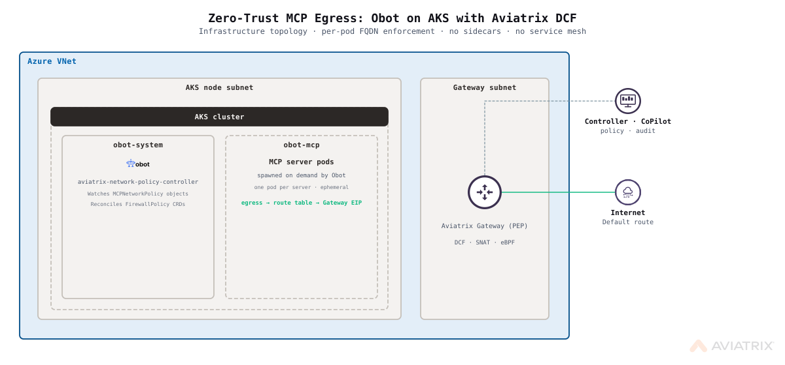
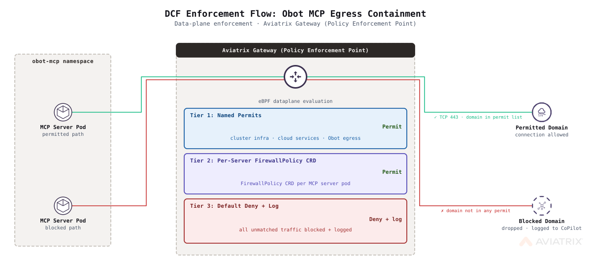

# Zero-Trust MCP Egress: Obot on AKS with Aviatrix DCF

Deploy [Obot](https://obot.ai) onto a new AKS cluster with network-layer zero-trust egress enforcement for all MCP server pods. An Aviatrix Gateway (Policy Enforcement Point) intercepts outbound traffic; MCPNetworkPolicy CRDs (reconciled by Obot's bundled aviatrix-network-policy-controller) translate per-server allowlists into live FirewallPolicy rules. No sidecars, no service mesh, no code changes required.

> [!TIP]
> **Deploying with an AI agent?** This blueprint includes [`AGENTS.md`](AGENTS.md): a machine-readable guide with required variables, exact deploy commands, verification steps, and common errors. Works with Claude Code, Codex, Cursor, and Gemini CLI.

## Architecture



Traffic flow:

1. Obot user creates an MCP server and configures its allowed egress domains via the Obot UI or API.
2. Obot's bundled `aviatrix-network-policy-controller` reconciles the server's `MCPNetworkPolicy` into an Aviatrix `FirewallPolicy` CRD.
3. The Aviatrix controller pushes the policy to the spoke gateway.
4. The spoke gateway enforces FQDN-based egress: permitted domains pass, everything else is dropped and logged.

Azure IP masquerade is disabled for all pod traffic so the spoke gateway sees original pod IPs. SmartGroups resolve pod identities via Kubernetes label selectors, enabling per-pod enforcement without sidecars.

## Enforcement Model



The Aviatrix Gateway (Policy Enforcement Point) intercepts all pod egress at the network layer. The `aviatrix-network-policy-controller` (bundled with Obot) watches `MCPNetworkPolicy` objects and reconciles them into `FirewallPolicy` CRDs. The Aviatrix controller pushes those policies to the spoke gateway, which enforces FQDN-based allow/deny without modifying pods or requiring a service mesh.

## Scope and Limitations

- **Supported MCP runtimes:** `npx`, `uvx`, and containerized servers only. Stdio-mode servers are not covered.
- **Protocol and port:** Enforcement applies to HTTPS egress on TCP 443 only. MCP servers requiring non-443 outbound connections are not protected by this feature.
- **Remote MCP servers:** Out of scope. This feature applies only to Kubernetes-hosted MCP servers deployed by Obot. Remote (SSE/HTTP) MCP server connections are not subject to these policies.
- **Domain format:** `egressDomains` entries must be bare hostnames. No protocols (`https://`), paths, ports, or IP addresses. `localhost` and `*.svc` cluster-local names are rejected by Obot at admission. Wildcard prefix notation is supported (e.g., `*.anthropic.com`).
- **Obot-specific domains are scoped to the `obot-system` namespace.** The blueprint creates a V1 permit SmartGroup using a K8s namespace selector (`k8s_namespace = "obot-system"`). This restricts the permit covering `api.anthropic.com`, GitHub, and `charts.obot.ai` to orchestration pods only. MCP server pods in `obot-mcp` do not match this rule and cannot reach those domains unless declared in `egressDomains`.
- **`npx` runtime servers require `registry.npmjs.org` in `egressDomains`.** The npx shim downloads the package from npm at pod startup. This download is subject to the same FirewallPolicy enforcement as all other egress. A server deployed without `registry.npmjs.org` in its `egressDomains` will have its `mcp` container fail (package download blocked) while the `shim` container stays running. Add `registry.npmjs.org` to `egressDomains` for any npx-runtime server. This is intentional: zero-trust requires explicit declaration of every outbound dependency, including package registries.
- **Azure node telemetry (`dc.services.visualstudio.com`) is intentionally blocked.** AKS nodes emit Application Insights telemetry to this endpoint. The default POST_RULES deny catches it because it is not in the infrastructure permit list; by design. AKS functions correctly without it. This is the correct zero-trust posture: every outbound flow that is not explicitly required and permitted is denied, including vendor telemetry. Adding it to the allowlist would undermine the enforcement boundary the blueprint is designed to demonstrate.

## Prerequisites

### Required Tools

- [Aviatrix Control Plane](../../docs/prerequisites/aviatrix-controller.md) (v8.2+) with CoPilot; Controller and CoPilot public IPs required
- [Terraform](../../docs/prerequisites/terraform.md) (v1.5+)
- [Azure CLI](../../docs/prerequisites/azure-cli.md), authenticated (`az login`)
- [kubectl](../../docs/prerequisites/kubectl.md), configured for your cluster
- **Python 3**: required by `local-exec` provisioners for JSON parsing (`curl | python3 -c`)

### Required Access

- Azure subscription with permissions to create resource groups, VNets, subnets, route tables, and AKS clusters
- Aviatrix Controller with an Azure access account (`arm_account_name`) already onboarded
- `Contributor` role on the target Azure subscription
- **vCPU quota:** at least 8 vCPUs for `standardDSv3Family` (default `aks_vm_size = Standard_D4s_v3`, 2 nodes). Verify remaining quota before deploying:

  ```bash
  az vm list-usage --location "<azure_location>" \
    --query "[?contains(name.value, 'standardDSv3Family')].{name:name.value,used:currentValue,limit:limit}" \
    -o table
  ```

  If quota is insufficient, override `aks_vm_size` to a smaller SKU (e.g. `Standard_D2s_v3` requires 4 vCPUs) or request a quota increase.

### Blueprint-Specific Requirements

- Obot >= 0.21.0 (the MCPNetworkPolicy egress provider was introduced in this release)
- `spoke_gateway_subnet_cidr` must not overlap `aks_subnet_cidr` or `vnet_address_space` sub-ranges used by other resources

## Resources Created

| Resource | Description | Quantity |
|----------|-------------|----------|
| Azure Resource Group | Contains all created resources | 1 |
| Azure Virtual Network | VNet for AKS nodes and spoke gateway | 1 |
| Azure Subnet | AKS node subnet (Azure CNI, pod IPs from VNet) | 1 |
| Azure Subnet | Aviatrix Gateway (Policy Enforcement Point) subnet | 1 |
| Azure Route Table | Public RT for spoke gateway subnet | 1 |
| Azure Route Table | Private RT for AKS node subnet (routes pod egress via spoke) | 1 |
| Azure Kubernetes Cluster | AKS cluster with Azure CNI | 1 |
| Azure Role Assignment | Network Contributor for AKS identity on resource group | 1 |
| Aviatrix Gateway (Policy Enforcement Point) | DCF-enforced egress gateway (no transit required) | 1 |
| Aviatrix Kubernetes Cluster | AKS onboarding for pod identity resolution | 1 |
| Aviatrix SmartGroup | MCP server pods (by namespace) | 1 |
| Aviatrix SmartGroup | AKS node subnet CIDR | 1 |
| Aviatrix SmartGroup | K8s API server public IP | 1 |
| Aviatrix SmartGroup | obot-system namespace (K8s selector, scopes orchestration-tier V1 permits) | 1 |
| Aviatrix WebGroup | AKS infrastructure egress domains | 1 |
| Aviatrix WebGroup | Obot application domains (Anthropic, GitHub) | 1 |
| Aviatrix DCF Policy List | V1 infrastructure permits | 1 |
| Aviatrix DCF Default Action | Deny-all at POST_RULES level | 1 |
| Kubernetes ConfigMap | Azure ip-masq-agent config (disables pod SNAT) | 1 |
| Kubernetes Namespace | Obot system namespace | 1 |
| Kubernetes Namespace | Obot MCP server namespace | 1 |
| Helm Release | k8s-firewall (Aviatrix CRDs: FirewallPolicy + WebgroupPolicy; no pods) | 1 |
| Helm Release | Obot platform (includes aviatrix-network-policy-controller) | 1 |

**Estimated Cost**: ~$0.15–0.25/hour for the spoke gateway VM (Standard_B2ms) plus AKS node costs (~$0.10–0.20/hour for Standard_D4s_v3 at 2 nodes).

## Deployment

### Step 1: Clone and Navigate

```bash
git clone https://github.com/AviatrixSystems/aviatrix-blueprints.git
cd aviatrix-blueprints/blueprints/obot-mcp-egress-azure
```

### Step 2: Configure Variables

```bash
cp terraform.tfvars.example terraform.tfvars
```

Edit `terraform.tfvars`. All fields marked `REQUIRED` must be set.

### Step 3: Deploy

```bash
terraform init
terraform plan
terraform apply
```

Deployment takes approximately 15–20 minutes (spoke gateway provisioning is the longest step).

### Step 4: Enable K8s Enforcement in CoPilot

All three items are automated by Terraform during `terraform apply`. Verify after deploy:

1. **DCF Kubernetes Enforcement**: automated by `null_resource.k8s_dcf_features`: verify in CoPilot → DCF → Settings → Enforcement on Kubernetes (should show Enabled)
2. **Log Enrichment** (for pod-level FlowIQ identity): automated by `null_resource.k8s_dcf_features`: verify in CoPilot → DCF → Settings → Log Enrichment (should show On)
3. **Kubernetes Clusters Onboarding**: automated by `aviatrix_kubernetes_cluster.aks`: verify in CoPilot → Cloud Resources → Cloud Workloads → Kubernetes Clusters (the AKS cluster should show as onboarded with pod count populated)

### Step 5: Verify Deployment

```bash
# Update kubeconfig for the new cluster
az aks get-credentials \
  --resource-group "$(terraform output -raw resource_group_name)" \
  --name "$(terraform output -raw aks_cluster_name)"

# Check Terraform outputs
terraform output

# Verify Obot is running
kubectl get pods -n obot-system

# Port-forward Obot UI (access at http://localhost:8080)
kubectl port-forward -n obot-system svc/obot-obot 8080:80
```

## Variables

| Variable | Description | Type | Default | Required |
|----------|-------------|------|---------|----------|
| `azure_subscription_id` | Azure subscription ID | `string` | n/a | yes |
| `azure_location` | Azure region (e.g. `"UK South"`) | `string` | n/a | yes |
| `controller_ip` | Aviatrix Controller IP or hostname | `string` | n/a | yes |
| `controller_username` | Controller admin username | `string` | `"admin"` | no |
| `controller_password` | Controller admin password | `string` | n/a | yes |
| `arm_account_name` | Azure access account name onboarded in Controller | `string` | n/a | yes |
| `arm_account_principal_id` | Azure AD Object ID of the Aviatrix ARM service principal. Get with: `az ad sp show --id <arm_ad_client_id> --query id -o tsv` | `string` | n/a | yes |
| `copilot_private_ip` | CoPilot private IP (syslog) | `string` | n/a | yes |
| `copilot_public_ip` | CoPilot public IP (OTEL/DCF Monitor) | `string` | n/a | yes |
| `resource_group_name` | Name of Azure resource group to create | `string` | `"obot-mcp-rg"` | no |
| `vnet_address_space` | VNet address space | `string` | `"10.1.0.0/16"` | no |
| `aks_subnet_cidr` | CIDR for AKS node subnet | `string` | `"10.1.0.0/20"` | no |
| `aks_vm_size` | Azure VM size for AKS nodes | `string` | `"Standard_D4s_v3"` | no |
| `aks_node_count` | Number of AKS nodes | `number` | `2` | no |
| `aks_service_cidr` | CIDR for K8s services (must not overlap VNet) | `string` | `"172.16.0.0/17"` | no |
| `aks_dns_service_ip` | K8s DNS service IP (must be within `aks_service_cidr`) | `string` | `"172.16.0.10"` | no |
| `spoke_gateway_subnet_cidr` | Subnet CIDR for Aviatrix Gateway (Policy Enforcement Point) | `string` | `"10.1.200.0/26"` | no |
| `spoke_gateway_size` | Azure VM size for spoke gateway | `string` | `"Standard_B2ms"` | no |
| `obot_version` | Obot Helm chart version (>= 0.21.0) | `string` | `"0.21.0"` | no |
| `npc_chart_version` | aviatrix-network-policy-controller chart version | `string` | `"v0.0.1"` | no |
| `obot_admin_password` | Obot admin password | `string` | n/a | yes |
| `obot_namespace` | Kubernetes namespace for Obot | `string` | `"obot-system"` | no |
| `obot_mcp_namespace` | Kubernetes namespace for MCP server pods | `string` | `"obot-mcp"` | no |
| `name_prefix` | Prefix for all created resource names | `string` | `"obot-mcp"` | no |
| `copilot_syslog_index` | Remote syslog index slot on the Controller (0-9); must be free | `number` | `9` | no |

## Outputs

| Output | Description |
|--------|-------------|
| `spoke_gateway_name` | Name of the deployed Aviatrix Gateway (Policy Enforcement Point) |
| `spoke_gateway_public_ip` | Public IP of the spoke gateway (all pod egress SNATs to this) |
| `obot_namespace` | Kubernetes namespace where Obot is deployed |
| `obot_mcp_namespace` | Kubernetes namespace where Obot deploys MCP server pods |
| `next_steps` | Post-deployment instructions |

## Test Scenarios

> **Prerequisite:** Complete Step 4 (Enable DCF Kubernetes Enforcement in CoPilot). The `FirewallPolicy` CRD is installed by the `k8s-firewall` Helm chart during `terraform apply`. Port-forward Obot before API calls:
> ```bash
> kubectl port-forward -n obot-system svc/obot-obot 8080:80
> # If 8080 is taken: kubectl port-forward -n obot-system svc/obot-obot 8081:80
> ```

### Step 0: Deploy a Test MCP Server

```bash
# Create a server with registry.npmjs.org permitted (required for npx package download)
SERVER=$(curl -s -X POST http://localhost:8080/api/mcp-servers \
  -H "Content-Type: application/json" \
  -d '{"manifest":{"name":"demo-server","runtime":"npx","npxConfig":{"package":"@modelcontextprotocol/server-filesystem","egressDomains":["registry.npmjs.org"]}}}')

SERVER_ID=$(echo $SERVER | python3 -c "import sys,json; print(json.load(sys.stdin)['id'])")
echo "Server ID: $SERVER_ID"

# Launch the server (required after every create or update)
curl -s -X POST http://localhost:8080/api/mcp-servers/${SERVER_ID}/launch

# Get pod name (pod = <server-id>-<suffix>; shim container = <server-id>-shim)
POD=$(kubectl get pods -n obot-mcp -l app=${SERVER_ID} -o jsonpath='{.items[0].metadata.name}')
echo "Pod: $POD"
```

### Scenario 1: Verify Permitted Domain Passes

```bash
kubectl exec -n obot-mcp $POD -c ${SERVER_ID}-shim -- \
  curl -s --max-time 10 -o /dev/null -w "HTTP:%{http_code}" https://registry.npmjs.org

# Expected: HTTP:200
```

### Scenario 2: Verify Unlisted Domain is Blocked

```bash
kubectl exec -n obot-mcp $POD -c ${SERVER_ID}-shim -- \
  curl -s --max-time 5 -o /dev/null -w "HTTP:%{http_code} Exit:%{exitcode}" https://api.openai.com

# Expected: HTTP:000 Exit:35
# HTTP:000 = no response; exit 35 = SSL connect error (DCF dropped at TLS handshake)
```

Check CoPilot → DCF → Monitor for the denied flow.

### Scenario 3: Update egressDomains and Verify New Domain is Permitted

```bash
# Add api.openai.com (PUT uses unwrapped manifest, no wrapper)
curl -s -X PUT http://localhost:8080/api/mcp-servers/${SERVER_ID} \
  -H "Content-Type: application/json" \
  -d '{"name":"demo-server","runtime":"npx","npxConfig":{"package":"@modelcontextprotocol/server-filesystem","egressDomains":["registry.npmjs.org","api.openai.com"]}}'

curl -s -X POST http://localhost:8080/api/mcp-servers/${SERVER_ID}/launch

kubectl get firewallpolicies -n obot-mcp

POD=$(kubectl get pods -n obot-mcp -l app=${SERVER_ID} --field-selector=status.phase=Running -o jsonpath='{.items[0].metadata.name}')
kubectl exec -n obot-mcp $POD -c ${SERVER_ID}-shim -- \
  curl -s --max-time 10 -o /dev/null -w "HTTP:%{http_code}" https://api.openai.com

# Expected: HTTP:4xx Exit:0 (any 4xx with exit code 0 means DCF permitted the connection and OpenAI responded)
```

## Cleanup

```bash
terraform destroy
```

If destroy hangs on `obot-system` or `obot-mcp` namespaces (PVC protection finalizer blocks deletion):

```bash
for NS in obot-system obot-mcp; do
  kubectl get ns $NS -o json 2>/dev/null | \
    python3 -c "import json,sys; ns=json.load(sys.stdin); ns['spec']['finalizers']=[]; print(json.dumps(ns))" | \
    kubectl replace --raw /api/v1/namespaces/$NS/finalize -f - 2>/dev/null || true
done
```

If a subsequent `terraform apply` fails with `unable to create new content in namespace obot-system because it is being terminated`, wait 30 seconds and re-run `terraform apply`.

If destroy fails due to Azure Route Table associations, remove them first:

```bash
az network vnet subnet update \
  --name <aks-subnet-name> \
  --vnet-name <vnet-name> \
  --resource-group <vnet-rg> \
  --remove routeTable
```

## Troubleshooting

### Spoke gateway creation fails or times out

Verify the gateway subnet is correctly classified as public:

```bash
az network route-table show \
  --name <name_prefix>-rt-avx-gw \
  --resource-group <vnet_resource_group> \
  --query routes
```

The `default-Internet` route with `nextHopType: Internet` must be present.

### DCF Monitor is empty but FlowIQ works

The spoke gateway OTEL exporter is not reaching CoPilot. This happens when `copilot_public_ip` is wrong or missing. Verify:

```bash
terraform output -raw spoke_gateway_public_ip
# This IP must be permitted in the CoPilot NSG for TCP 31284 inbound.
# Note: spoke_gateway_public_ip is a sensitive output; use -raw to see the value.
```

### egressDomains configured but traffic still blocked

1. Check feature flags were applied: `terraform apply` re-runs the `k8s_dcf_features` provisioner each apply. Verify in CoPilot → DCF → Settings: Enforcement on Kubernetes = Enabled, Log Enrichment = On.
2. Confirm the AKS cluster is onboarded in CoPilot: Cloud Resources → Cloud Workloads → Kubernetes Clusters (cluster should show pods). If missing, check whether `aviatrix_kubernetes_cluster.aks` in terraform state is healthy; re-run `terraform apply` to retry.
3. Confirm a `FirewallPolicy` exists for the server: `kubectl get firewallpolicies -n obot-mcp`
4. Check pod labels match the FirewallPolicy selector: `kubectl get pod <pod-name> -n obot-mcp --show-labels`

### NPC pod logs: `no matches for kind 'FirewallPolicy' in group 'networking.aviatrix.com'`

The `FirewallPolicy` CRD is installed by the Aviatrix controller when DCF Kubernetes Enforcement is activated. The `aviatrix-network-policy-controller` cannot reconcile MCPNetworkPolicy objects until the CRD exists, and will log this error in a requeue loop.

1. The `firewallpolicies.networking.aviatrix.com` CRD is installed by the `k8s-firewall` Helm chart (part of this blueprint's `terraform apply`); if missing, the chart may have failed; check: `helm list -n aviatrix-system`
2. The NPC error loop resolves automatically within 30–60 seconds once the CRD exists
3. Verify: `kubectl get crds | grep networking.aviatrix.com`

### SmartGroups show workload_type as VM instead of k8s

Log Enrichment feature flag may not have been applied. Run `terraform apply` to re-run `null_resource.k8s_dcf_features` which sets this flag automatically. Verify: CoPilot → DCF → Settings → Log Enrichment = On.

## Tested With

| Component | Version |
|-----------|---------|
| Aviatrix Controller | 8.2.x |
| Aviatrix Terraform Provider | 8.2.0 |
| Terraform | 1.9.x |
| AzureRM Provider | 3.116.x |
| Obot | 0.21.0 |

## Built With

This blueprint was developed by [Nick Davitashvili](https://github.com/nickda) (Aviatrix) in collaboration with [Grant Linville](https://github.com/g-linville) (Obot AI), who built the MCPNetworkPolicy egress provider in Obot.

## Contributing

See the [Contributing Guide](../../CONTRIBUTING.md) for information on how to contribute to this blueprint.

## License

Apache 2.0. See [LICENSE](../../LICENSE)
