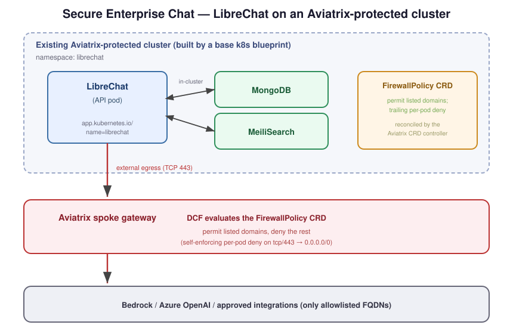

# Secure Enterprise Chat

Deploy **LibreChat** onto an **already-running, Aviatrix-protected Kubernetes
cluster** and enforce least-privilege egress with the Aviatrix Distributed Cloud
Firewall (DCF). This blueprint is **not** a cluster builder — it layers a chat
app onto a cluster you already stood up with one of the Kubernetes blueprints
(e.g. `azure-aks-singlecluster`, `aws-eks-singlecluster`).

It is, deliberately, **really just a Helm chart**:

- a **values overlay** for the **official** LibreChat chart (official container
  images, no custom build, no vendored application source),
- the app config (`librechat.yaml`) and a secret template (`.env.example`),
- a **translator shim** that turns `librechat.yaml` into an Aviatrix
  `FirewallPolicy` CRD so egress is allowed only to the backends you configured,
- and three ways to apply it: raw Helm, an optional thin Terraform wrapper, or
  ArgoCD/GitOps.

## Architecture



```
  Existing Aviatrix-protected cluster (built by a base k8s blueprint)
  ┌───────────────────────────────────────────────────────────────┐
  │  ns: librechat                                                  │
  │   ┌─────────────┐   in-cluster    ┌───────────┐ ┌────────────┐ │
  │   │  LibreChat  │◄───────────────►│  MongoDB  │ │ MeiliSearch│ │
  │   │   (API pod) │                 └───────────┘ └────────────┘ │
  │   └──────┬──────┘  app.kubernetes.io/name=librechat            │
  │          │ external egress (TCP 443)                           │
  └──────────┼──────────────────────────────────────────────────  │
             ▼
      Aviatrix spoke gateway  ──  DCF evaluates the FirewallPolicy CRD
             │                     (permit listed domains, deny the rest)
             ▼
      Bedrock / Azure OpenAI / image registries / approved integrations
```

The base blueprint already provides: the cluster, the Aviatrix spoke gateway
with DCF **default-deny** egress, and the **Aviatrix CRD controller** (K8s
SmartGroup onboarding). This blueprint adds the workload and a `FirewallPolicy`
CRD that the controller reconciles into live DCF rules scoped to the LibreChat
pod. Nothing here is permitted to egress until it appears in that policy.

## What's in this folder

| Path | Purpose |
|---|---|
| `chart/values.yaml` | Overlay for the official LibreChat chart (pins the official image, ingress, deps). |
| `chart/librechat.yaml` | App config **and** the single source of truth for the egress allowlist. |
| `chart/.env.example` | Template for the `librechat-credentials-env` Secret (AI creds, JWT/CREDS keys). |
| `egress-policy/` | The translator shim: `generate.py` + `egress-catalog.yaml`. Produces the `FirewallPolicy` CRD. |
| `argocd/application.yaml` | Example ArgoCD Application (multi-source) for GitOps deploys. |
| `examples/with-mcp/` | Worked example: MCP servers (remote + subprocess + internal) and the resulting allowlist. See its README. |
| `main.tf`, `variables.tf`, `versions.tf`, `outputs.tf` | **Optional** thin Terraform `helm_release` wrapper. |

> No LibreChat application source is vendored here. The chart pulls
> `registry.librechat.ai/danny-avila/librechat`.

## Prerequisites

### Already deployed
- A Kubernetes blueprint cluster with the **Aviatrix K8s CRD controller**
  onboarded (any singlecluster blueprint; the multicluster blueprints also work
  per-cluster). Confirm the cluster shows fully onboarded (not "Partial") in
  CoPilot before relying on CRD enforcement.
- **DCF micro-segmentation must be enabled on the base spoke** so CRD policies
  are enforced (confirm the cluster is fully onboarded in CoPilot). The generated
  policy is **self-enforcing**: it ends with a per-pod `deny-other-egress` rule
  (tcp/443 → `0.0.0.0/0`) after the permits, so it does **not** depend on a
  fabric-wide default-deny — permitted FQDNs pass, everything else from the
  LibreChat pods is dropped. (A fabric-wide default-deny is still good
  defense-in-depth. Pass `--no-default-deny` to the generator to omit the
  trailing deny and rely on the fabric instead.)
- A **default StorageClass** backed by a working CSI driver (the chart's
  MongoDB/MeiliSearch want PVCs). The repo's EKS blueprints
  (`aws-eks-singlecluster`, `aws-eks-multicluster`) already provision this — their
  nodes layer installs the `aws-ebs-csi-driver` addon and a default `gp3`
  StorageClass — so clusters built from them satisfy this out of the box. You
  only need to add one for an **externally-built or non-EKS cluster** that lacks a
  default StorageClass (on EKS 1.23+ the legacy in-tree `gp2`,
  `kubernetes.io/aws-ebs`, does **not** provision). For an ephemeral lab you can
  instead set `*.persistence.enabled=false`.

### Required tools
- `kubectl`, configured for the target cluster
- `helm` >= 3.8 (OCI support) — for the raw-Helm path
- `python3` + `pip` — for the egress-policy shim (`pip install -r egress-policy/requirements.txt`)
- `terraform` >= 1.5 — only for the optional TF wrapper

## Resources Created

This blueprint **does not build infrastructure** — it layers a workload and a
firewall policy onto a cluster you already own. There is **no incremental
Aviatrix or cloud control-plane spend**; the only cost is the compute/storage the
chart consumes on the existing cluster.

| Resource | Where | Created by | Cost note |
|---|---|---|---|
| `librechat` Helm release (LibreChat API pod) | existing cluster | Helm / TF wrapper | Rides existing node capacity; ~no new spend |
| `mongodb` (Deployment + PVC) | existing cluster | LibreChat chart dep | ~1 small PVC on the default StorageClass (e.g. `gp3` ~$0.08/GB-mo) |
| `meilisearch` (StatefulSet + PVC) | existing cluster | LibreChat chart dep | ~1 small PVC on the default StorageClass |
| `librechat-credentials-env` Secret | existing cluster | you (kubectl) | none |
| `FirewallPolicy` CRD (+ reconciled DCF ruleset/attachmentPoint/SmartGroups/WebGroup) | Aviatrix Controller | egress generator + CRD controller | none (rules on the existing spoke) |
| Ingress record / LB (if your ingress controller provisions one) | cloud | existing ingress controller | Standard ALB/LB hourly + LCU if exposed |
| **Optional** IAM role for Bedrock via IRSA | AWS | you (`eksctl`/console) | IAM is free; Bedrock usage billed per token |

**Estimated cost:** **~$0 incremental** for the lab itself (PVC storage is a few
cents/day). Bedrock/Azure OpenAI token usage and any internet-facing
load balancer are billed normally by the cloud provider.

## Deploy

### Step 1 — Create the credentials Secret

```bash
cd blueprints/secure-enterprise-chat
cp chart/.env.example chart/.env
# edit chart/.env: set CREDS_KEY/CREDS_IV/JWT_*/MEILI_MASTER_KEY and your AI creds
kubectl create namespace librechat 2>/dev/null || true
kubectl -n librechat create secret generic librechat-credentials-env \
  --from-env-file=chart/.env
```

### Step 2 — Generate and apply the egress FirewallPolicy

The policy is derived from `chart/librechat.yaml`. Note the `--pod-label`: the
chart labels the pod `app.kubernetes.io/name=librechat`.

```bash
pip install -r egress-policy/requirements.txt
python egress-policy/generate.py \
  --config chart/librechat.yaml \
  --env chart/.env \
  --namespace librechat \
  --pod-label app.kubernetes.io/name=librechat \
  --output egress-policy/firewall-policy.yaml

kubectl apply -f egress-policy/firewall-policy.yaml
```

Review the generated file first — it lists exactly which domains will be
permitted. Anything not listed stays denied by the base cluster's DCF.

### Step 3 — Install the chart (pick ONE)

**A) Raw Helm**

```bash
helm install librechat oci://ghcr.io/danny-avila/librechat-chart/librechat \
  --version 2.0.2 \
  --namespace librechat --create-namespace \
  -f chart/values.yaml \
  --set-file librechat.configYamlContent=chart/librechat.yaml \
  --set ingress.hosts[0].host=chat.example.com
```

**B) Terraform wrapper**

```bash
cp terraform.tfvars.example terraform.tfvars   # set kube_context, ingress_host
terraform init
terraform apply
```

**C) ArgoCD / GitOps** — see [`argocd/application.yaml`](argocd/application.yaml)
and the GitOps section below.

All three consume the **same** `chart/values.yaml` + `chart/librechat.yaml`.

> [!IMPORTANT]
> **Ingress class must match your base cluster.** `chart/values.yaml` ships
> `ingress.className: nginx`, which assumes the base cluster runs ingress-nginx
> (the AKS singlecluster path). This repo's EKS blueprints (`aws-eks-*`) instead
> ship the **AWS Load Balancer Controller** (`className: alb`). On those, set
> `--set ingress.className=alb`, or skip ingress for a quick test with
> `--set ingress.enabled=false` and `kubectl port-forward`. Otherwise the install
> fails with `admission webhook ... denied the request: invalid ingress class:
> IngressClass "nginx" not found`.

## CI/CD integration

The egress policy must be regenerated whenever `chart/librechat.yaml` (or the
catalog) changes, so the allowlist never drifts from the running config. This
repo ships the shim but **not** a workflow — wire it into your pipeline. Run the
generator with `--env-keys` so secret *values* never touch CI (only key names):

```yaml
# .github/workflows/secure-enterprise-chat-egress.yml (reference)
name: secure-enterprise-chat-egress
on:
  push:
    paths:
      - blueprints/secure-enterprise-chat/chart/librechat.yaml
      - blueprints/secure-enterprise-chat/egress-policy/egress-catalog.yaml
jobs:
  generate:
    runs-on: ubuntu-latest
    permissions: { contents: write }
    steps:
      - uses: actions/checkout@v4
      - uses: actions/setup-python@v5
        with: { python-version: "3.11" }
      - run: pip install -r blueprints/secure-enterprise-chat/egress-policy/requirements.txt
      - name: Derive set env keys from secrets
        id: keys
        run: |
          KEYS=""
          [ -n "${{ secrets.AZURE_API_KEY }}" ] && KEYS="$KEYS,AZURE_API_KEY"
          [ -n "${{ secrets.TAVILY_API_KEY }}" ] && KEYS="$KEYS,TAVILY_API_KEY"
          echo "keys=${KEYS#,}" >> "$GITHUB_OUTPUT"
      - run: |
          python blueprints/secure-enterprise-chat/egress-policy/generate.py \
            --config blueprints/secure-enterprise-chat/chart/librechat.yaml \
            --namespace librechat --pod-label app.kubernetes.io/name=librechat \
            --env-keys "${{ steps.keys.outputs.keys }}" \
            --output blueprints/secure-enterprise-chat/egress-policy/firewall-policy.yaml \
            --strict
      - name: Commit regenerated policy
        run: |
          git config user.name github-actions
          git config user.email github-actions@github.com
          git add blueprints/secure-enterprise-chat/egress-policy/firewall-policy.yaml
          git diff --cached --quiet || git commit -m "chore: regenerate LibreChat egress FirewallPolicy"
          git push
```

`--strict` fails the build if subprocess (`uvx`/`npx`) MCP servers are present
(they can't be domain-isolated in-pod — use the Aviatrix OBOT VCA instead).

## GitOps: a standalone app repo

Because `chart/` and `egress-policy/` are self-contained, you can lift them into
their own app repo and let ArgoCD/Flux drive everything:

1. Copy `chart/` + `egress-policy/` into a new repo.
2. Point [`argocd/application.yaml`](argocd/application.yaml) `repoURL` at it.
3. Have CI regenerate `firewall-policy.yaml` on config change (above) and sync
   it as a second, tiny ArgoCD Application (directory source).
4. The loop becomes: edit `librechat.yaml` → CI regenerates the CRD → Argo syncs
   both the chart and the policy. Config and its firewall posture move together.

## AWS Bedrock auth via IRSA (recommended on EKS)

LibreChat passes **no explicit credentials** to the Bedrock client when
`BEDROCK_AWS_ACCESS_KEY_ID`/`BEDROCK_AWS_SECRET_ACCESS_KEY` are unset, so the AWS
SDK default provider chain resolves the **IRSA** web-identity token (or EKS Pod
Identity). No long-lived keys in the cluster.

1. **IAM role + trust policy** (IRSA) — allow the cluster's OIDC provider to
   assume the role for the `librechat` SA in your namespace:
   ```json
   {
     "Version": "2012-10-17",
     "Statement": [{
       "Effect": "Allow",
       "Principal": { "Federated": "arn:aws:iam::<ACCOUNT_ID>:oidc-provider/oidc.eks.<region>.amazonaws.com/id/<OIDC_ID>" },
       "Action": "sts:AssumeRoleWithWebIdentity",
       "Condition": { "StringEquals": {
         "oidc.eks.<region>.amazonaws.com/id/<OIDC_ID>:sub": "system:serviceaccount:librechat:librechat",
         "oidc.eks.<region>.amazonaws.com/id/<OIDC_ID>:aud": "sts.amazonaws.com"
       }}
     }]
   }
   ```
   ```bash
   # one-liner alternative (handles the trust policy for you):
   eksctl create iamserviceaccount --cluster <cluster> --namespace librechat \
     --name librechat --attach-policy-arn arn:aws:iam::aws:policy/AmazonBedrockFullAccess \
     --approve --override-existing-serviceaccounts
   ```
   Attach a permissions policy allowing `bedrock:InvokeModel*` (scope to the
   model ARNs you use; `AmazonBedrockFullAccess` is the broad option).

2. **Wire the role to the SA** (pick one):
   - Helm: `--set serviceAccount.annotations."eks\.amazonaws\.com/role-arn"=<role-arn>` (or set it in `chart/values.yaml`).
   - Terraform: `irsa_role_arn = "<role-arn>"`.

3. **Keep the BEDROCK_AWS_* keys out of `chart/.env`**, but still set
   `BEDROCK_AWS_DEFAULT_REGION` (LibreChat reads region from it).

Egress is already covered: `sts.amazonaws.com` (token exchange) is in the
catalog and is emitted whenever Bedrock is enabled, and `bedrock-runtime.<region>`
comes from `librechat.yaml`.
**Pod Identity** alternative: create a Pod Identity association (SA→role) + the
pod-identity-agent addon; no SA annotation needed (LibreChat uses the same
default chain).

## Variables (Terraform wrapper)

| Variable | Default | Description |
|---|---|---|
| `kubeconfig_path` | `~/.kube/config` | kubeconfig for the existing cluster |
| `kube_context` | `""` | context for the target cluster (empty = current) |
| `namespace` | `librechat` | install namespace (match the policy `--namespace`) |
| `release_name` | `librechat` | keep as `librechat` to preserve the pod label |
| `chart_version` | `2.0.2` | official LibreChat chart version |
| `ingress_host` | `chat.example.com` | ingress hostname |
| `irsa_role_arn` | `""` | IAM role ARN for Bedrock via IRSA; annotates the SA. Empty = none |

## Outputs (Terraform wrapper)

| Output | Description |
|---|---|
| `release_name` | Installed Helm release name |
| `namespace` | Install namespace |
| `chart_version` | Installed chart version |
| `pod_label_selector` | The label the FirewallPolicy must select (`--pod-label`) |

## Test Scenarios

### Scenario 1: Permitted backend reaches its target
Open a chat against a configured backend (e.g. Bedrock). It responds. In CoPilot
→ Security → DCF → Monitor, the flow to `bedrock-runtime.<region>.amazonaws.com`
shows **permitted** against the `librechat-egress` policy.

### Scenario 2: Default-deny blocks the unlisted
From the LibreChat pod, attempt egress to a domain not in the policy. The
official image ships `node` (not `curl`), so probe with a small node script:
```bash
kubectl -n librechat exec deploy/librechat -- node -e \
  'require("https").get({host:"example.org",port:443,timeout:5000},r=>{console.log("reachable",r.statusCode);process.exit()}).on("timeout",()=>{console.log("blocked as expected");process.exit()}).on("error",e=>console.log("blocked as expected:",e.code))'
```
It is denied (connection reset or timeout); the drop is visible in DCF Monitor.

### Scenario 3: Config change tightens/loosens the policy
Remove the `bedrock` block from `chart/librechat.yaml` **and** unset
`BEDROCK_AWS_DEFAULT_REGION` (and `BEDROCK_AWS_MODELS`) in `chart/.env`, then
regenerate (Step 2), recreate the secret, and `kubectl apply`. The Bedrock
domains (`bedrock-runtime.<region>.amazonaws.com`, `sts.amazonaws.com`) drop out
of the allowlist and that egress is now denied — the allowlist tracks the config
exactly. Note: the generator derives the Bedrock domain from **both**
`endpoints.bedrock` in `librechat.yaml` **and** `BEDROCK_AWS_DEFAULT_REGION` in
the env (so the allowlist matches what the pod can actually reach), so you must
clear **both** sources to remove it.

## Cleanup

```bash
# Chart
helm uninstall librechat -n librechat        # or: terraform destroy
# Egress policy
kubectl delete -f egress-policy/firewall-policy.yaml
# Secret + namespace
kubectl -n librechat delete secret librechat-credentials-env
kubectl delete namespace librechat
```

If you created an IRSA role for Bedrock via `eksctl create iamserviceaccount`,
it is **not** managed by this blueprint — delete it so it doesn't orphan:
```bash
eksctl delete iamserviceaccount --cluster <cluster> --namespace librechat --name librechat
```

The base cluster (and its DCF default-deny) is left intact — tear it down with
its own blueprint when finished.

## Troubleshooting

**Policy doesn't match the pod / no enforcement.** The selector must equal the
pod label. The chart uses `app.kubernetes.io/name: librechat` (from
`fullnameOverride`). If you changed the release name, regenerate with
`--pod-label app.kubernetes.io/name=<release>`. Verify:
`kubectl -n librechat get pod -l app.kubernetes.io/name=librechat`.

**Unlisted egress still reachable (deny not enforced).** With the default
self-enforcing policy this should not happen. If it does: (a) you generated with
`--no-default-deny` and the fabric has no default-deny; (b) DCF
micro-segmentation isn't enabled on the spoke / the cluster shows "Partial"; or
(c) the policy's pod selector doesn't match (see the pod-label note below).
Quick check from the running pod:
```bash
POD=$(kubectl get pod -n librechat -l app.kubernetes.io/name=librechat -o jsonpath='{.items[0].metadata.name}')
kubectl exec -n librechat $POD -- node -e 'require("https").get({host:"example.org",port:443,timeout:8000},r=>{console.log("reachable",r.statusCode);process.exit()}).on("timeout",()=>{console.log("BLOCKED (good)");process.exit()}).on("error",e=>console.log(e.code))'
```
`reachable 200` means default-deny is **not** active — enable DCF
micro-segmentation / default-deny on the base spoke before relying on this.

**OCI chart pull fails with `docker-credential-desktop ... not found`.** A stale
`~/.docker/config.json` (`credsStore: desktop`) breaks the `oci://` chart pull
for **all three install paths** — raw Helm, the Terraform wrapper (the `helm`
provider hits the same credential helper), and ArgoCD. Point the tool at a clean
Docker config: `mkdir -p /tmp/dc && echo '{}' >/tmp/dc/config.json`, then prefix
the command — `DOCKER_CONFIG=/tmp/dc helm install ...` **or**
`DOCKER_CONFIG=/tmp/dc terraform apply`.

**MongoDB pod `ErrImagePull` (`docker.io/bitnami/mongodb:...: not found`).** As of
Aug 2025 Bitnami relocated most images out of `docker.io/bitnami`. Override to the
legacy repo: `--set mongodb.image.repository=bitnamilegacy/mongodb` (or run your
own MongoDB and point LibreChat at it).

**Pods `Pending` on `unbound ... PersistentVolumeClaims`.** The cluster has no
default StorageClass that can provision. Clusters built from this repo's EKS
blueprints already ship a default `gp3` StorageClass (EBS CSI driver), so this
should not occur there. On an externally-built or non-EKS cluster (e.g. legacy
`gp2` on EKS 1.34 has no in-tree provisioner), install the EBS CSI driver + a
default CSI StorageClass, or disable persistence:
`--set mongodb.persistence.enabled=false --set meilisearch.persistence.enabled=false --set librechat.imageVolume.enabled=false`
(MeiliSearch is a StatefulSet — its volumeClaimTemplate is immutable on upgrade,
so delete the STS + PVC if you toggle this after first install).

**Pods stuck pulling images / app can't start.** Image pulls happen on the node
(kubelet), not from the pod, so they are **not** governed by this pod-scoped
FirewallPolicy — and the catalog deliberately does not list image-registry
domains. If pulls fail, ensure the base blueprint permits **node** egress to the
image registries (a separate, node-level concern).

**LibreChat crashes on boot.** Confirm the `librechat-credentials-env` Secret
exists in the namespace and contains `CREDS_KEY`, `CREDS_IV`, `JWT_SECRET`,
`JWT_REFRESH_SECRET`, and `MEILI_MASTER_KEY`.

**No "Sign Up" button / can't create an account.** LibreChat treats
`ALLOW_REGISTRATION`/`ALLOW_EMAIL_LOGIN` as disabled when unset, and the chart
doesn't set them. Put them in the **credentials Secret** (they're in
`.env.example`) — not in Helm `configEnv`, which only templates a fixed key set
and silently drops arbitrary keys. Verify: `kubectl exec deploy/librechat -- printenv ALLOW_REGISTRATION`.
To create a user without the signup page, the image ships
`npm run create-user -- <email> <password> <name>`.

**Azure OpenAI egress denied.** The generator parses `endpoints.custom[].baseURL`,
not the first-class `azureOpenAI` block. Configure Azure as a custom endpoint
(see `chart/librechat.yaml`) or add an `env_gated` entry for `AZURE_API_KEY` →
`*.openai.azure.com` in `egress-policy/egress-catalog.yaml`.

**CRD not reconciled.** Confirm the base cluster shows fully onboarded (not
"Partial") in CoPilot and the Aviatrix CRD controller is healthy.

**Bedrock `ValidationException: ... on-demand throughput isn't supported`.** Use a
cross-region **inference profile** id (`us.`/`eu.` prefix), e.g.
`us.anthropic.claude-3-5-haiku-20241022-v1:0`, not the bare model id. The IAM
policy must allow `bedrock:InvokeModel*` on both the `inference-profile/*` ARN and
the underlying `foundation-model/anthropic.*` ARNs (the role created for IRSA
covers both).

## Tested With

| Component | Version |
|---|---|
| LibreChat chart | 2.0.2 (appVersion v0.8.4) |
| Aviatrix Controller | 8.1+ (FQDN SmartGroups); 9.0+ for path-level filtering |
| Helm | 3.8+ |
| Terraform (wrapper) | >= 1.5, hashicorp/helm ~> 2.17 |
| Base blueprint | azure-aks-singlecluster (dev target); any singlecluster |
